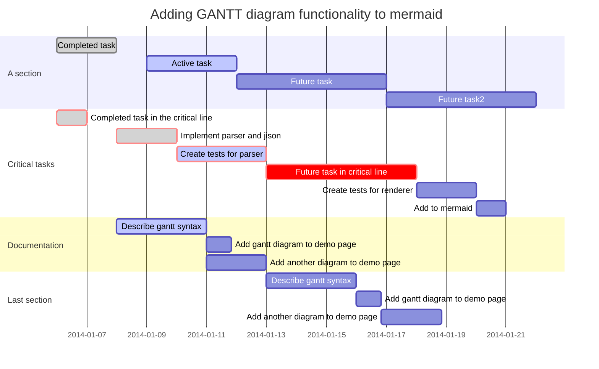

From Wikipedia:

Association football, more commonly known as football or soccer,[2] is a sport played between two teams of eleven players with a spherical ball. It is played by 250 million players in over 200 countries, making it the world's most popular sport.[3][4][5][6] The game is played on a rectangular field with a goal at each end. The object of the game is to score by getting the ball into the opposing goal.

The goalkeepers are the only players allowed to touch the ball with their hands or arms while it is in play and then only in their penalty area. Outfield players mostly use their feet to strike or pass the ball, but may use their head or torso to strike the ball instead. The team that scores the most goals by the end of the match wins. If the score is level at the end of the game, either a draw is declared or the game goes into extra time and/or a penalty shootout depending on the format of the competition. The Laws of the Game were originally codified in England by The Football Association in 1863. Association football is governed internationally by the International Federation of Association Football (FIFA; French: Fédération Internationale de Football Association) which organises a World Cup every four years.[7]


```sequence
Alice->Bob: Hello bob, how are you? 
Note right of Bob: Bob thinks
Bob->Alice: I am good thanks!
Alice->Bob: Let's have some fun coding with typora!
```





