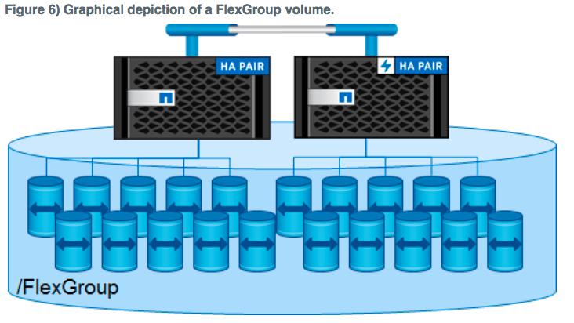
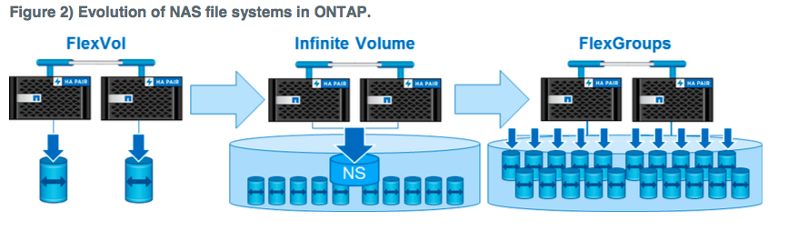
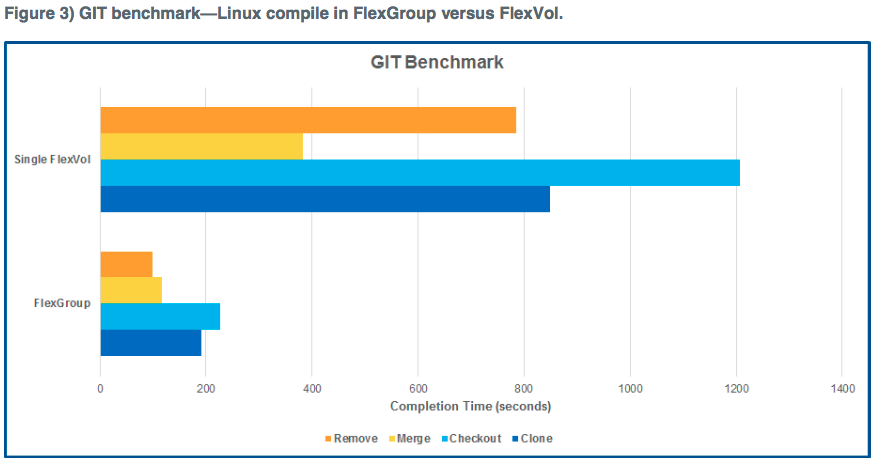

ONTAP 9.1RC1当中，出现了不少有趣的功能，例如，卷加密，FlexGroup等。当然还包括原本在7G和7模式中的功能的实现，比如Snaplock。

说到FlexGroup，不得不回顾一下我刚刚开始学习集群模式的时候的感觉。当时除了认为硬件架构上虽然是HA对组成的集群，还有一定的局限性之外，在软件上最明显的一个疑问就是，为什么还是使用FlexVol（灵活卷），而不设计一个集群式的文件系统。因为很显然，FlexVol在集群模式中，依然是限制于单个聚合中，也就意味着限制于单个节点所能提供的读写能力上。这势必会影响整个集群的性能。所以也一直期待每一次的版本更新中，能有一个这样的集群式文件系统。FlexGroup虽然还不完美，有他的专门的应用场景，但是已经至少具备了雏形，为以后的文件系统的计划奠定了一个好的基础。

所以今天，就来说说FlexGroup。

* **什么是FlexGroup？**

  集群式文件系统。通过将多个成员卷组合成一个单一的存储空间，供应用使用。兼顾了单一的容器功能和高性能。

  

* **和FlexVol有什么区别？**

  不再绑定在单个节点上，虽然多个FlexVol可以通过Junction挂在到一个全局明明空间，但是呈现出来的是一个具有多个目录的共享空间，并不是单一目录。每个FlexVol需要单独管理，维护。

* **和无限卷有什么区别？**

  无限卷没有在兼顾容量的同时兼顾性能。性能受限于存放metadata的成员的单个节点。更适合存储备份数据。

  

- **性能怎么样？**

  性能上，因为FlexGroup的设计，大幅的超越FlexVol。

  Linux上的编译过程中涉及的操作类型进行了性能对比，柱状图越短代表完成的时间越短，即性能越好。从这里可以看到FlexGroup全面胜出。

  

* 文件读写流程

  文件的存放按照空间和负载的平衡来存储到各个成员卷中。文件不会被条带化，而是作为整个文件存放到一个成员卷中的。NFS或者SMB的客户端通过共享访问FlexGroup，从共享的创建到访问的方法上和FlexVol没有区别。
