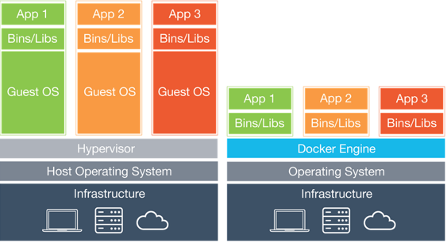

### Docker 是什么？

**Docker** 可以说这2，3年风头正劲，发展迅猛。特别是当结合Ochestration的工具例如**Kubernetes**，可以将容器按照集群管理起来，可以说把容器的利用范畴上升了一个档次。我这两年也一直在关注Docker这家公司以及他们的技术。虽然容器技术早已经出现，但是Docker把容器的概念简化到1条`docker run`命令，让容器的易用性大幅提升，学习的门槛大大降低，所以说容器技术的大放异彩Docker功不可没。

### Docker和虚拟机的区别？

在聊Docker和NetApp之前，我想先说明以下Docker和虚拟化技术的不同。Docker和虚拟化技术经常拿来做对比，因为比较容易混淆。我觉得如果学习过操作系统的底层概念，对这部分的区分应该还是比较容易的。虚拟化技术无论是Type1还是Type2的Hypervisor都是将底层硬件做虚拟化，让虚拟机可以利用这些虚拟的资源运行起来，然后在虚拟机上运行应用。而容器技术，是没有Hypervisor这一层的。Docker作为实际上是作为用户空间的一组进程来运行，而容器本身是把应用和底层的操作系统解耦之后的可运行的程序。容器本身是一个独立的应用和它以来的bin和运行库的一个组合。正因为这样的特性，让容器的不再局限于底层的虚拟机或者物理机，具备非常优秀的可迁移能力。




### Docker和NetApp的关系？

现在说说NetApp在容器里面扮演了一个怎样的角色。容器在使用磁盘空间的时候，缺省情况下是使用本地主机的目录，这样的特性可以说当容器只运行在这个主机上的时候还不存在太大的问题。但是如果容器想要迁移到其他的主机，例如DevOps中，从开发环境，到测试，生产环境后，本地磁盘上的数据如何才能在这些环境上都能够访问呢？因此Docker中推出了卷的概念和功能。即用户可以创建卷，而这个卷可以是本地的目录，也可以是共享存储上的。这样的好处是，容器可以在不同的主机上运行，而依赖的的数据可以在这些主机上自由访问。我们举一个例子，假设有3台主机，我们在1号主机上运行一个web服务器。所有的网页资料等信息都放到共享存储上。当我们需要在2号和3号主机上运行这个容器的时候，我们依然可以访问到这些资料。Web服务器可以无缝的在不同主机上迁移。所以NetApp就有一个非常好的和容器技术的结合点。因为我们可以提供共享存储。并且，NetApp并没有这样笨的来做，因为大部分的DevOps环境中，卷的操作如果再让存储管理员来做就脱离了原本DevOps带来的便利性。NetApp通过`nDVP`这样一个插件，达到了这些效果：

* 无缝集成了nDVP到Docker中，通过Docker的标准的命令访问NetApp的ONTAP系列，E系列，SolidFire系列的存储
* 通过标准命令可以创建、删除，拍快照，创建Clone等企业级存储的功能
* 实现更加高级的service class功能，可以根据不同的需求，创建需要的存储
* 通过配置文件来设置对存储的定义

### 如何安装和使用nDVP

[nDVP](https://netapp.io/containers/)的安装和配置也并不难，免费从Docker Store上下载后，按照[文档](http://netappdvp.readthedocs.io/en/latest/)的介绍安装配置即可。

nDVP同时也是NetApp的`Trident`的底层支撑的插件。Trident可以帮助容器集群管理的软件例如Kubernetes实现多个平台上的存储资源的管理。Trident可以和Kubernetes，Openshift等结合在一起工作，提供动态的可持续的存储资源的分配。

总结一下，==nDVP为单个容器提供了分配管理NetApp的存储资源的能力，Trident借助nDVP，为集群化的大规模的容器提供动态的存储资源分配。==

下面通过一些简单的例子来说明部署nDVP，以及使用的方法。

- ->安装命令:

```
docker plugin install netapp/ndvp-plugin:17.07 --alias netapp --grant-all-permissions
```

- ->管理卷:

```
# create a volume named "firstVolume"
docker volume create -d netapp --name firstVolume

# create a default volume at container instantiation
docker run --rm -it --volume-driver netapp --volume secondVolume:/my_vol alpine ash

# remove the volume "firstVolume"
docker volume rm firstVolume
```

而nDVP是通过json的配置文件来获取存储的相关信息的，例如`/etc/netappdvp/config.json`。

```
# create a location for the config files
sudo mkdir -p /etc/netappdvp

# create the configuration file, see below for more configuration examples
cat << EOF > /etc/netappdvp/config.json
{
    "version": 1,
    "storageDriverName": "ontap-nas",
    "managementLIF": "10.0.0.1",
    "dataLIF": "10.0.0.2",
    "svm": "svm_nfs",
    "username": "vsadmin",
    "password": "netapp123",
    "aggregate": "aggr1"
}
EOF
```

这些都可以在nDVP的文档中找到。

并且，有些时候可能需要在统一主机中运行多个nDVP的实例。此时就可以借助不同的配置文件，结合docker的别名和config选项调用不同的driver。

例如，通过下面两个命令，我们同事运行了两个nDVP的实例。一个的别名是`silver`，一个别名是`gold`。

```
docker plugin install --grant-all-permissions --alias silver netapp/ndvp-plugin:17.07 config=silver.json
```

```
docker plugin install --grant-all-permissions --alias gold netapp/ndvp-plugin:17.07 config=gold.json
```

在创建卷的时候，可以通过`-d drivername`的方式来分别调用不同的plugin。

```
# gold volume
docker volume create -d gold --name ntapGold

# silver volume
docker volume create -d silver --name ntapSilver
```

当然，如果系统中有ONTAP，SolidFire的多个系统，也可以通过这样的方式，为不同的存储类型配置单独的json文件，然后并行运行。在创建卷的时候就可以根据实际需要来调用不同的存储资源了。

如果想更多的了解Docker和nDVP的信息，推荐去[The Pub](https://netapp.io/#)包括了很多NetApp和前沿的技术的结合。例如CI/CD，Configuration Management，OpenStack等等。

**Let's Rock with NetApp!**

