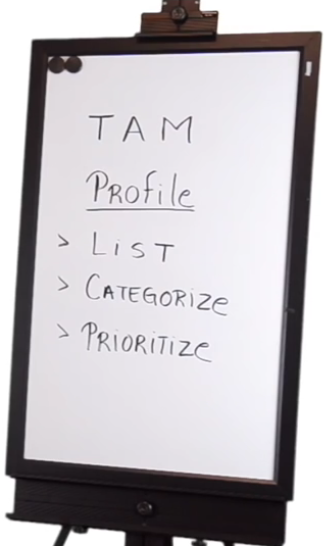

### Part III: [How to Sell Your Product or Service - Market Segment & Client Profile](https://www.youtube.com/watch?v=WwbiQG0sUgs)

**TAM**: Total Avaliable Market

显然我们不能面对所有的市场，而是要针对特定市场。如果不Focus，销售就会失败。Focus是销售的关键点。

1. 首先要做的是，有一个Profile
2. 然后创建一个目标市场的列表
   - B2C List: 个人消费者，或者apartment owner
   - B2B List: Commercial
   - Hybrid (B2C & B2B) List:
3. 然后把列表进行分类 
4. 把分类进行优先顺序排列

销售不成功，有时候不是因为产品，也不是因为销售技巧，而是销售给了错误的对象。

销售的成功需要两个基本要素：**客户有需求，有预算**。我觉得还需要一个要素，就是你的产品可以满足这个需求！

### Part IV: Competition and Analysis

FBA: Feature Benefit Advantage

在第二部分，做出了产品的目录，FBA属于产品目录中的一个条目。主要是体现产品对于客户的价值到底是什么。

把自己的产品和竞争对手的产品，对比FBA1，FBA2，FBA3。。。

主要目的是找到差异，把自己的产品和对手的产品区别开，让客户看到自家产品的不同价值。

同样作为销售，应该熟知这些点，可以帮助你

1. 更好的了解自己的产品
2. 更好的了解对手的强弱
3. 区别自己的产品
4. 攻击对手的弱点

### Part V: Designing a Sales Process

Sales Process 的意义是一致性 ，Consistency。

否则无法带来稳定的一致的销售结果。

销售过程包含7个步骤。

1. Research：调研阶段
2. 1st Meeting with customer
3. Presentation
4. Demo
5. Options
6. Pricing
7. Close the Sales

但是这个流程不是一成不变的，应该不断的改进，结合自己的特点，最终变成自己的版本。

目标是缩短你的销售周期。

### Part VI：Introducint Meeting & Asking Questions

- Open-Close：
  - Open：为了获取信息，多用How；挖掘信息，挖掘客户对当前的解决方案的看法，不足之处，这些都是下次做Presentation时要去解决的一些问题。
  - Close：为了获取确认
- 80-20 Rule: 给客户更多的时间谈，而不是自己夸夸其谈。但是不要搞成对客户的审判。在当中分享一些信息给客户。
- Situation -> Problem

### Part VII：Delivering a Sales Presention

- 自己提出客户可能会问的反对意见。例如价格

### Part VIII: Demonstrating Your Product

