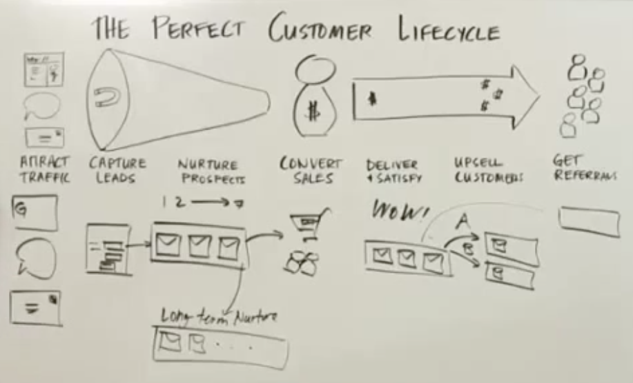

### 销售Pipeline的7个阶段

[seven phases of your sales pipeline 2015](https://www.youtube.com/watch?v=8YVnFGJ92Qo)

不仅仅要重视产生机会的阶段，也要重视后期的再次销售，或者销售别的商品给同一个客户。

### Pipeline 和 Forecast的预测

在现实中，针对Pipeline转换成forecast并不是按照简单的百分比来划分，做预测的。

简单的规则：只有能close这一单的可能性超过8成，才能算做Forecast的数量。而低于这个可能性的，都不能算。

对于高于8成的，我们要定义具体的条件（guideline），哪些条件满足，哪些条件还需要更多的工作。

[Sales Pipeline - Don't Use Weighted Probability to Forecast](https://www.youtube.com/watch?v=QkHdeiAWYFM)