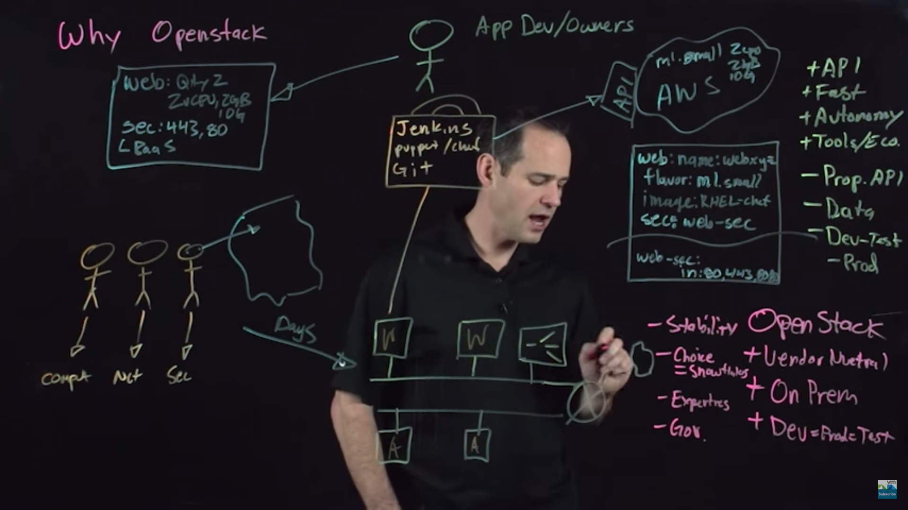
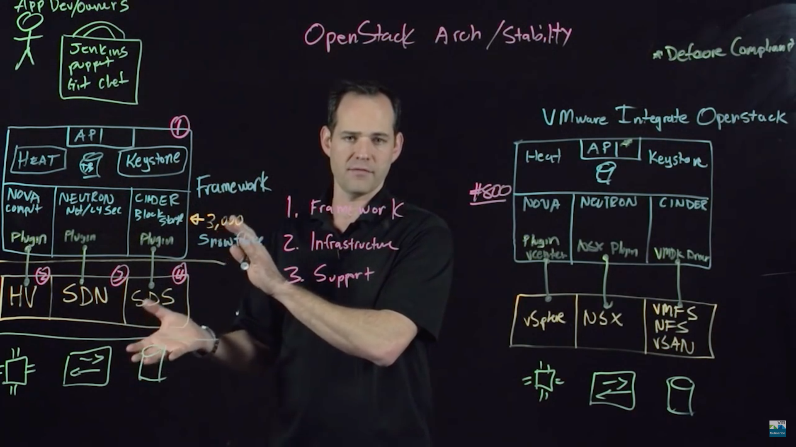
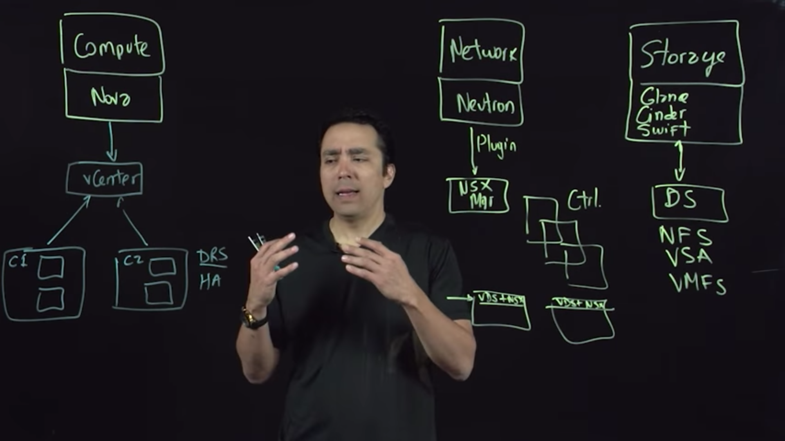

1. Why OpenStack from VMWare expert

   [Why OpenStack](https://www.youtube.com/watch?v=Bk4NoUsikVA&t=4s)

   - Cloud like cosumption model without the cons of Public Cloud.
   - API
   - Dev = Test = Prod
   - On Prem

   

2. Architecture and Stability

   [OpenStack and VMWare Infrastructure OpenStack](https://www.youtube.com/watch?v=ijnYlUoVxsI)

   

3. Prerequisite of VIO Deployment

   [Getting Ready to Deploy VMware Integrated OpenStack](https://www.youtube.com/watch?v=23egG37z8yQ)

   

   再部署VIO之前，需要做的准备工作：

   1. 计算部分 - Nova
      - vCenter
      - vSphere的多个集群，并且注册到Nova
      - Nova看到的不是单个的集群，而是vCenter层面的一个大的虚拟资源池
      - vCenter中的多个集群可以利用原有的集群间通讯，例如DRS，HA，FT，vMotion等，完全独立的提供更加稳定的架构，Nova层面不用感知到
   2. 网络部分 - Neutron
      - 最重要的是需要vDS （Vitual Distributed Switch）
      - Neutron通过插件方式透过NSX Manager和Ctrl Cluster，网络层面通讯
      - VMWare的NSX（软件定义网络）
   3. 存储部分 - Storage
      - 只需要有DataStore即可（NFS，VSAN，VMFS）
      - Glance和Cinder都通过插件访问
      - Swift还不支持，需要通过第三方的产品提供

   

4. OpenStack相关网站信息

   [Deploy, Using, Operation and Managing VIO](https://featurewalkthrough.vmware.com/t/vmware-integrated-openstack/)

   [NetApp OpenStack](https://www.netapp.com/us/solutions/it-automation/openstack-private-cloud.aspx)

