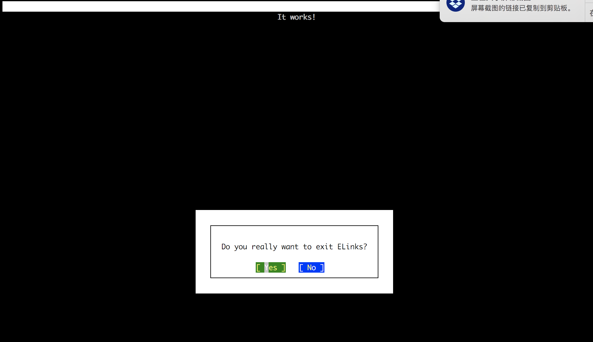

Linux的容器技术（LXC）和Docker相互促进，催生了这几年容器技术的大发展。

如果想了解容器技术的基本概念，可以看我前段时间写的一篇文章：[作为NetApp，我们为何关心Docker](https://airzhang23.github.io/blogs/Docker/)。

我也好几次被问到Docker到底是什么，能用来做什么。

如果用简单的几句话来总结，我对他的定义就是，轻量化，独立封装的应用，可以很容易的部署，二次开发应用。好处很多，但是我认为最大的好处就是**速度**和**可移动性**。

想想一下，我们现在想搭建一个网店，你需要几个部分来构建，前段的网络服务器，后端的数据库，认证等等。这需要你安装应用，配置好你想要的样子，然后部署你的代码，调试等等。

而通过Docker技术，你可以从现有的Hub上直接下载你需要的Image，例如Ubuntu，Oracle，MangoDB，SQL，等等，而这西Image可以进行进一步的定制化，然后通过简单的`Docker run`命令就可以启动你的容器。这些容器就可以开始工作了。省掉了大量的安装，配置，软件的时间。而且由于容器是自封装的，也就意味着可以在任意拥有Docker的平台上运行。

下面我用一个小例子来展示一下。

假设我想启动一个Apache的Web Server，之前我的做法是：

1. 到Apache下载相应的版本（当然一般是最新版 ^_^）
2. 然后安装到我的主机上
3. 配置httpd的配置文件
4. 启动服务器
5. 测试服务器是否可以访问，如果碰到问题，还要不断的反复3，4，甚至2。
6. 而这个配置是针对我的主机的，并不能迁移到别的主机

有了Docker，我的工作流就变成了：

1. 安装Docker（如果已经有了，就省了）
2. `docker pull httpd:latest` 下载最新的httpd的image
3. `docker run -d -p 80:80 httpd:latest`
4. 通过`elinks httpd://localhost`或者浏览器测试访问性

```
[user@leiz1 ~]$ docker pull httpd:latest
latest: Pulling from library/httpd
3d77ce4481b1: Pull complete
73674f4d9403: Pull complete
d266646f40bd: Pull complete
ce7b0dda0c9f: Pull complete
01729050d692: Pull complete
014246127c67: Pull complete
7cd2e04cf570: Pull complete
Digest: sha256:72f2b4aa99235509146bd12054d1a93c1c869ba60212d21729118c93ca4305d3
Status: Downloaded newer image for httpd:latest
[user@leiz1 ~]$
[user@leiz1 ~]$ docker images
REPOSITORY                 TAG                 IMAGE ID            CREATED             SIZE
mycustomimg/withservices   v1                  c90183ae9cb4        21 hours ago        376MB
centos7/entry              v1                  b85ea933a5cc        4 days ago          200MB
centos7/echo               v1                  3f2250f3ccbd        4 days ago          200MB
centos7/nonroot            v1                  72d6e1f7943b        6 days ago          200MB
<none>                     <none>              92f2e1eb7f88        6 days ago          200MB
<none>                     <none>              425f1b1c12a2        6 days ago          200MB
newcentos                  withapache          492b9fd55540        7 days ago          329MB
ubuntu                     latest              113a43faa138        2 weeks ago         81.1MB
nginx                      latest              cd5239a0906a        2 weeks ago         109MB
centos                     latest              49f7960eb7e4        2 weeks ago         200MB
httpd                      latest              fb2f3851a971        7 weeks ago         177MB
centos                     6                   70b5d81549ec        2 months ago        195MB
centos                     centos6             70b5d81549ec        2 months ago        195MB
[user@leiz1 ~]$ docker run -d --name web1 -p 80:80 httpd:latest
1e799e2f9c91bc51ed2db03be5fddc247f9fc0327a4b6b3a29a39d2c452e2f7d
[user@leiz1 ~]$ docker ps
CONTAINER ID        IMAGE               COMMAND              CREATED             STATUS              PORTS                NAMES
1e799e2f9c91        httpd:latest        "httpd-foreground"   4 seconds ago       Up 3 seconds        0.0.0.0:80->80/tcp   web1
[user@leiz1 ~]$ elinks http://localhost
```

elinks显示出来 "It works"，表示httpd服务器已经启动，并运行正常。




下面就可以开始部署你的网页到服务器了。

对我来讲，我节省了很多下载，安装，配置的时间。

如果我想对Image做进一步的定制化，例如在里面安装工具，配置文件等，可以利用`Dockerfile`来进行配置，之后通过`docker build`把Dockerfile的信息封装到新的Image里面。而这个Image可以分发到其他的主机，而且是和我的现有主机上的版本保持一致。

例如，可以通过Dockerfile把写好的html网页拷贝到htdocs里面，当httpd启动的时候就可以直接利用自己写的网页了。

```dockerfile
FROM httpd:2.4
COPY ./public-html/ /usr/local/apache2/htdocs/
```

加入你不想使用Apache，更钟情于Ngnix，怎么办？没问题，Ngnix也已经容器化，并且在Docker Hub上可以直接下载使用。

```
➜  ~ docker images
REPOSITORY          TAG                 IMAGE ID            CREATED             SIZE
ubuntu              xenial              5e8b97a2a082        2 weeks ago         114MB
nginx               latest              cd5239a0906a        2 weeks ago         109MB
httpd               latest              fb2f3851a971        7 weeks ago         178MB
```

