---

layout: post

title: AWS CSA - Associate Level 学习笔记 - Week 1 - Part I

img: AWS_CSA_001.png

---

### Notes AWS Certified Solutions Architect - Associate Level (Prep Course) - Week 1


[Interactive Diagram](https://interactive.linuxacademy.com/diagrams/AWSSolutionsArchitectPreview.html)

###Day 1

成为**M类型**的架构师。

具备知识的广度，宽度，同时也对一些部分具备深度的知识。或者可以快速学习这些知识的能力。

所谓Solution Architect，这个人的工作是在客户和实施工程师之间，为客户按照需求设计他们的云架构。并且在安全性，灵活性，性能等方面做到优化的配置。


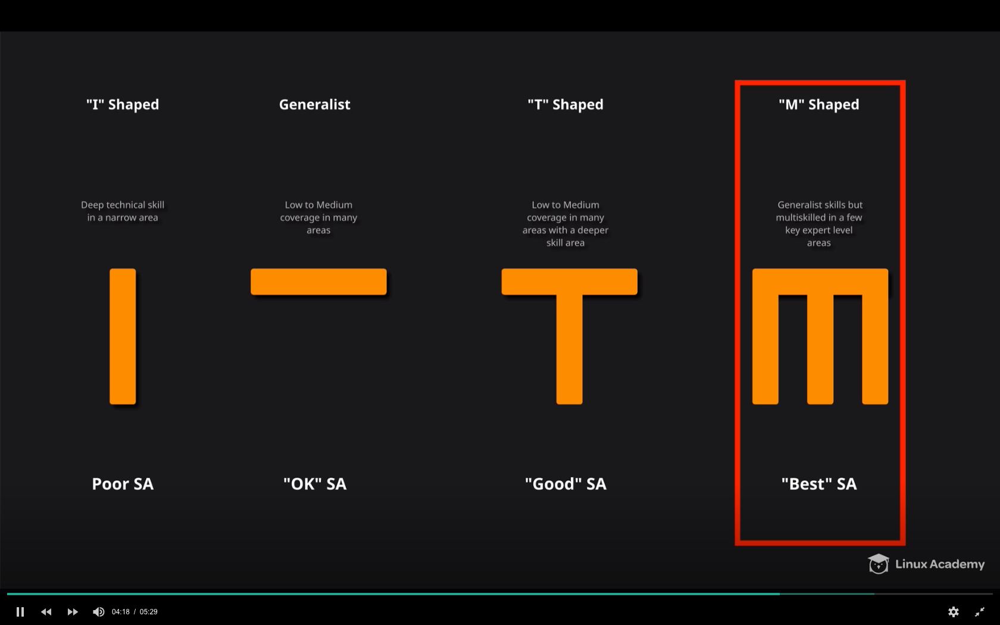


- 这一部分有两项任务，或者最佳实践：
  * 设置Billing
  * 设置MFA

- 设置AWS账号，Free Tier，安全设置

  - Email，密码，信用卡，MFA
  - 公司账户： Professional
  - 个人账户：Personal

- AWS Management Console

  - 账号创建成功，登陆后，进入
  - 可以通过my billing&cost management console设置使用量和账单管理，当费用超过free tier的价格时，可以发送alert到指定的email地址。

  

  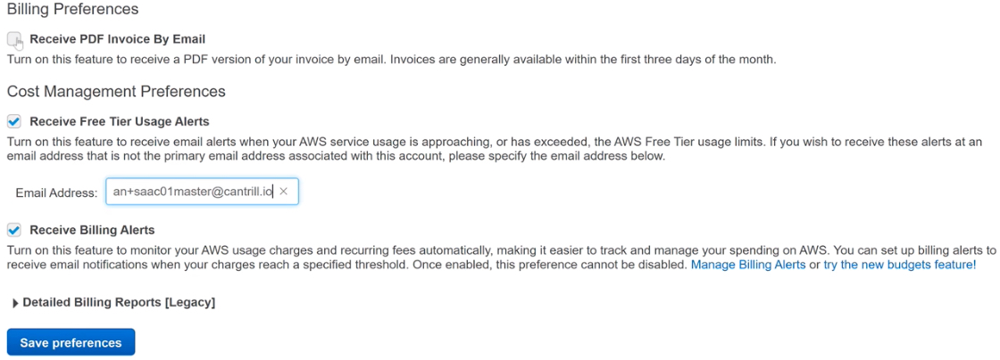

  

- 也可以通过**CloudWatch**设置alarm来监控，通过SNS服务，当估算的费用超过10美元时，发送警报

- 另外一点，通过enable Cost Explorer可以收集各种服务所涉及的费用，使用量等等的信息。可以在billing&cost management console进行设置。

  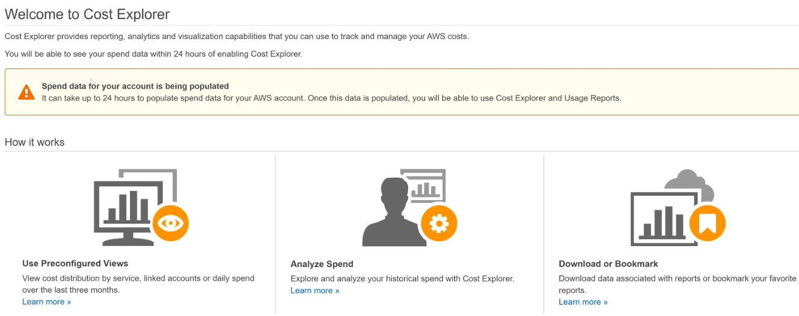

- 为了提高root用户的安全性，可以对root用户设置MFA

  这样设置成功后，每次登陆root账户，输入email和密码后，需要输入MFA Code才能login。

  

  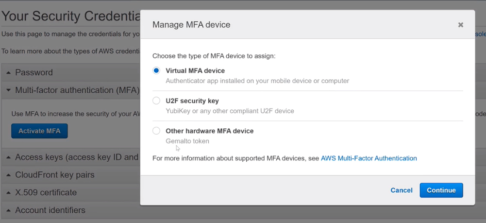


#### Access Management

- Principle: a person or application that can make authenticated or anonymous request to perfomr an action on a system
- Authentication: Prove you are the person you claim to be
- Identity: Objects that can be accessed
- Authorization: operations that can or can't be done on Identity

###### 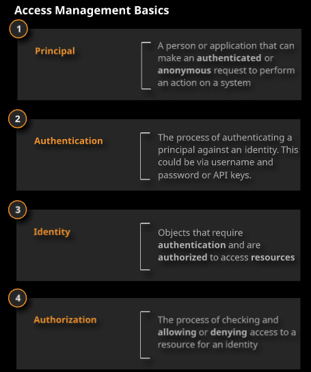

### Day 2 - Architecture 101

- Security

- Shared Responsibility: 哪些部分是用户的责任，哪些是AWS的负责的

  云本身的安全是AWS负责，在云里面的安全是用户负责。

  ###### 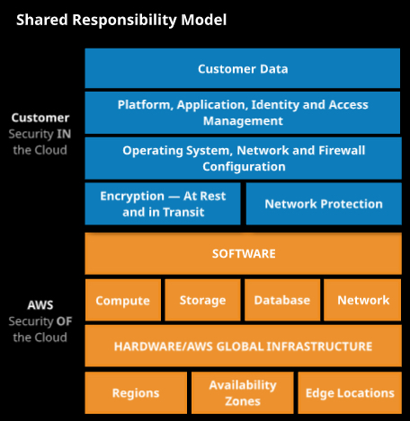


- Service Models
  - IaaS: OS above, OS + Runtime + Application + Data
  - PaaS: Application + Data
  - SaaS: Data
- HA and FT
  - High Availability: <u>**recover quickly**</u> there is impact, outage
  - Fault Tolerance: **<u>operate through a failure with no user impact</u>**

###### 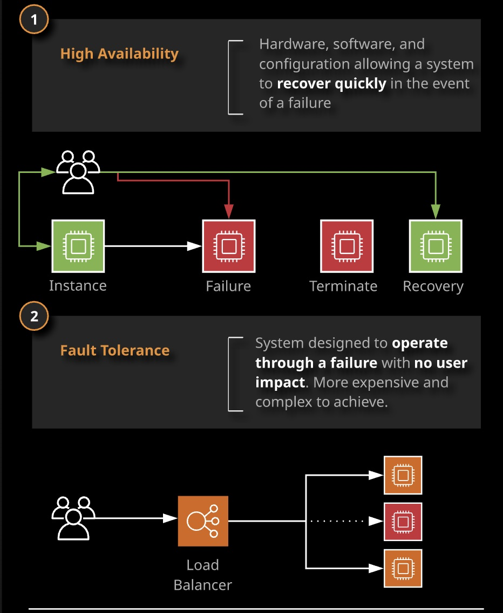

- HA，可以用汽车做类比。当轮胎出现问题的时候，你需要停下车子，换一个轮胎。类似Active-Passive模式。
- FT，可以用飞机做类比。当一个引擎出现故障的时候，依然可以用剩余的引擎继续工作。这个时候不能使用HA的方式。FT其实类似于Active-Active的HA。

- Disaster Recovery

  ​	作为Solution Architecture，需要对DR，RPO和RTO有深入的理解，能够为客户设计出满足他们的业务需要的架构。

  - RPO: Recovery **Point** Objective 发生故障时，你的backup能恢复到什么时间点的数据。例如每天晚上11点有一个备份，如果第二天10点钟发生故障，意味着有23小时的数据都没有了。
  - RTO: Recovery **Time** Objective 从发生故障到服务重新启动的时间差，换句话说，能容忍的服务宕机时间

###### 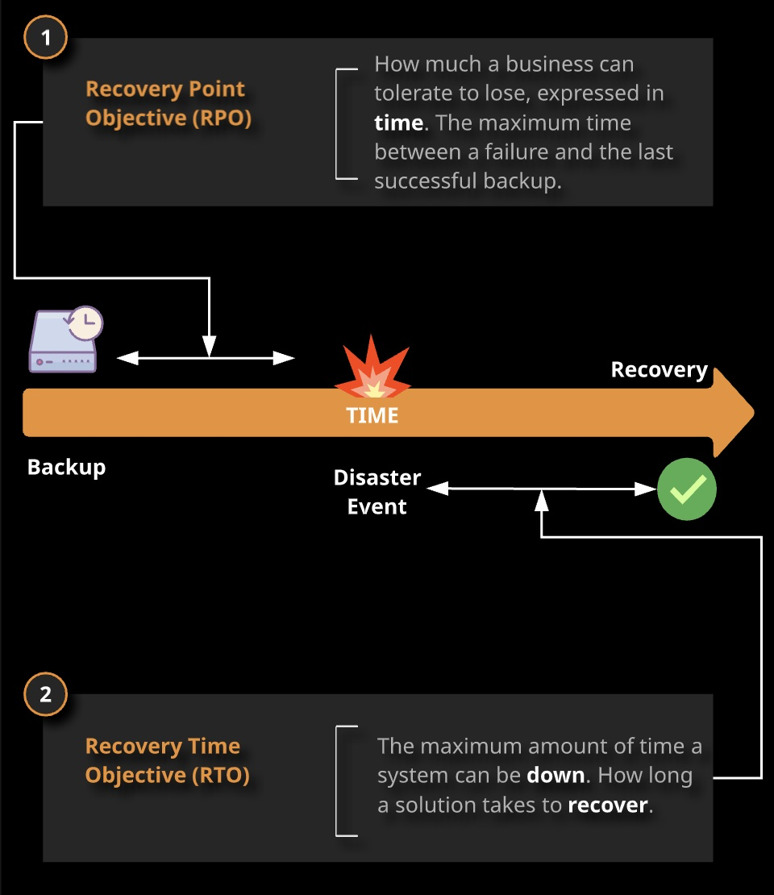


- Scaling

  - 和Elastic是不同的概念
  - Vertical Scaling: adding resourses like CPU, memory, storage to increase, there is limit

  ###### 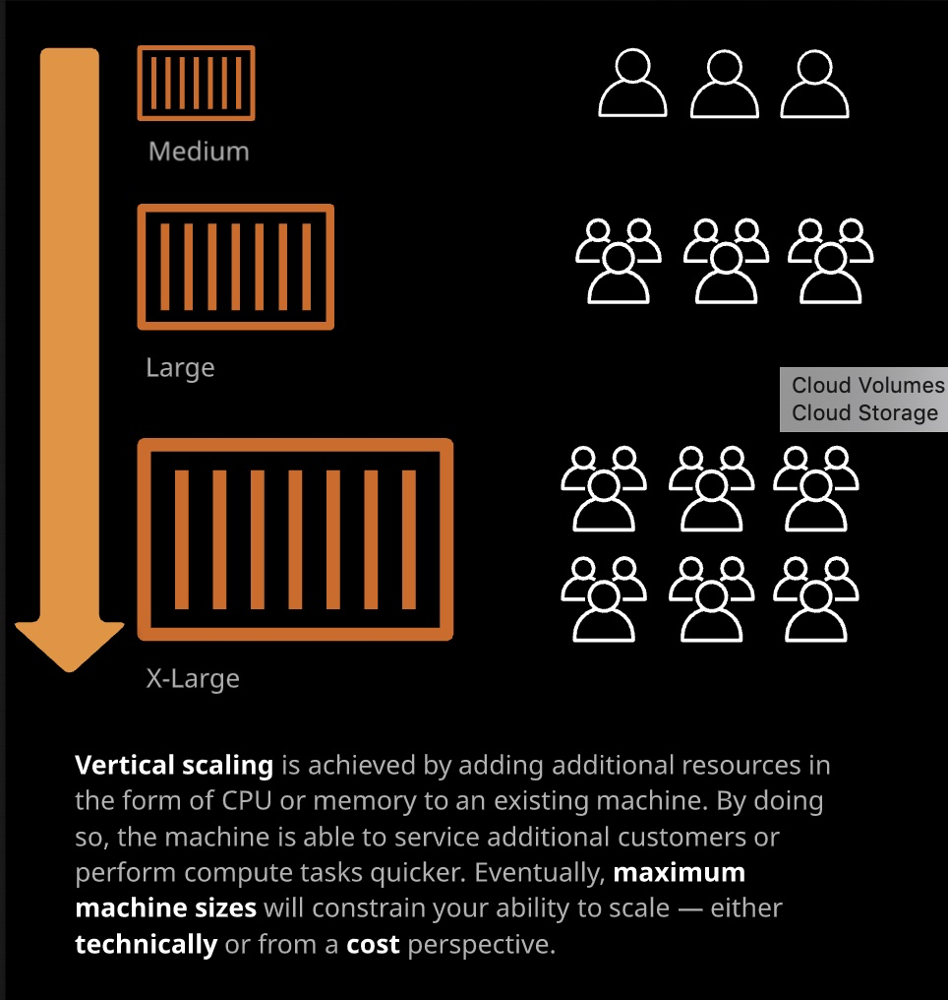

  

  - Horizontal Scaling: 需要application support。通过添加更多的机器，通过横向扩展的方式拓展资源池。更加复杂，同时也更加efficient。

  ###### 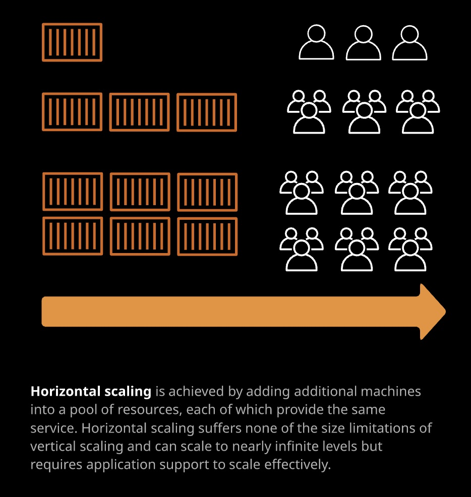

- Tiered application design

  - 3个基本层次

    - Presentation
    - Logic
    - Data

  - **基本原则**：在实现每个层次的时候，使用独立的组件。从架构上，从不同的VM，不同的pool来分配，提供资源给不同的层次。这样可以独立的进行scaling。

    

    ###### 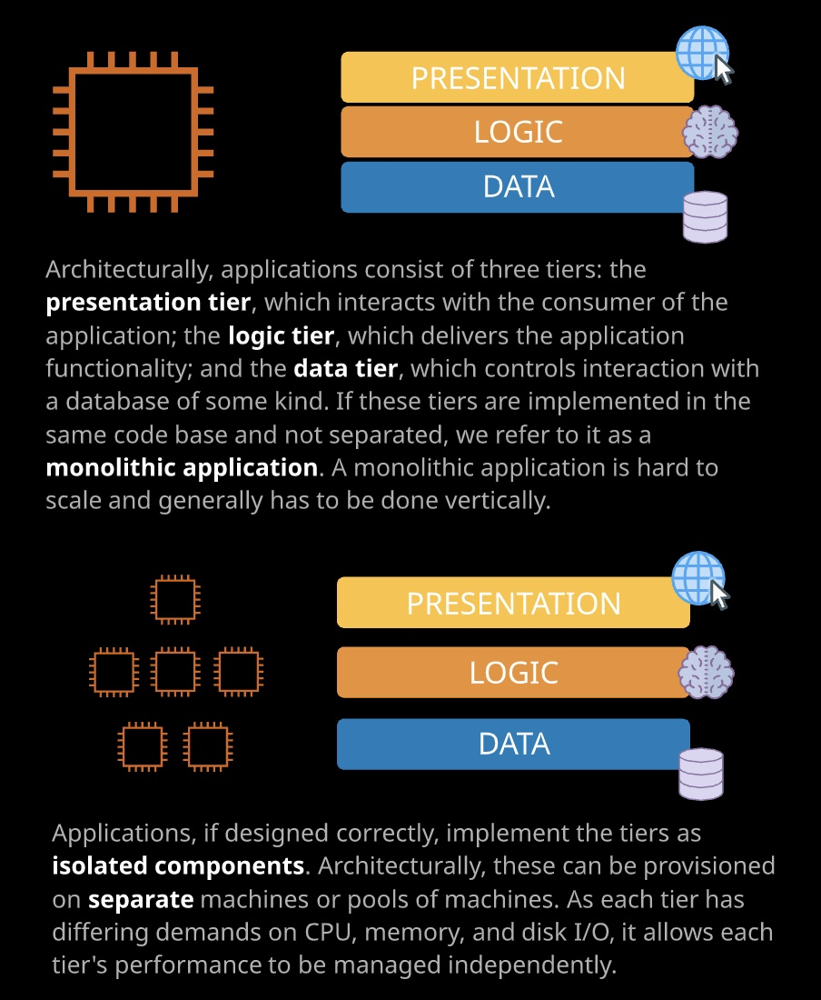

- Encryption

  - Encryption at rest: 数据生成后，通过加密算法，对数据进行加密解密
  - Encryption in transit：https, netflix等，数据在通讯过程中就通过加密算法实时加密解密
  - Symmetrical（用相同的key加密和解密，解密的时候需要告诉对方密钥）, Asymmetrical （用不同的key加密和解密，即public key和private key）两种类型的算法
  - 两种加密方法的例子：

  ```bash
  echo "Cats are Amazing" > hiddenmessage.txt
  gpg -c hiddenmessage.txt
  cat hiddenmessage.txt.gpg
  # this clears the cached password
  echo RELOADAGENT | gpg-connect-agent
  gpg -o output.txt hiddenmessage.txt.gpg
  rm hiddenmessage.txt.gpg
  rm output.txt
  gpg --gen-key
  gpg --armor --output pubkey.txt --export 'Adrian'
  gpg --armor --output privkey.asc --export-secret-keys 'Adrian'
  gpg --encrypt --recipient 'Adrian' hiddenmessage.txt
  gpg --output decrypted.txt --decrypt hiddenmessage.txt.gpg
  ```

- 不同的架构
  - Cost-effective architecture
  - Secure architecture
  - Application session state
  - Undifferentiated heavy lifting

  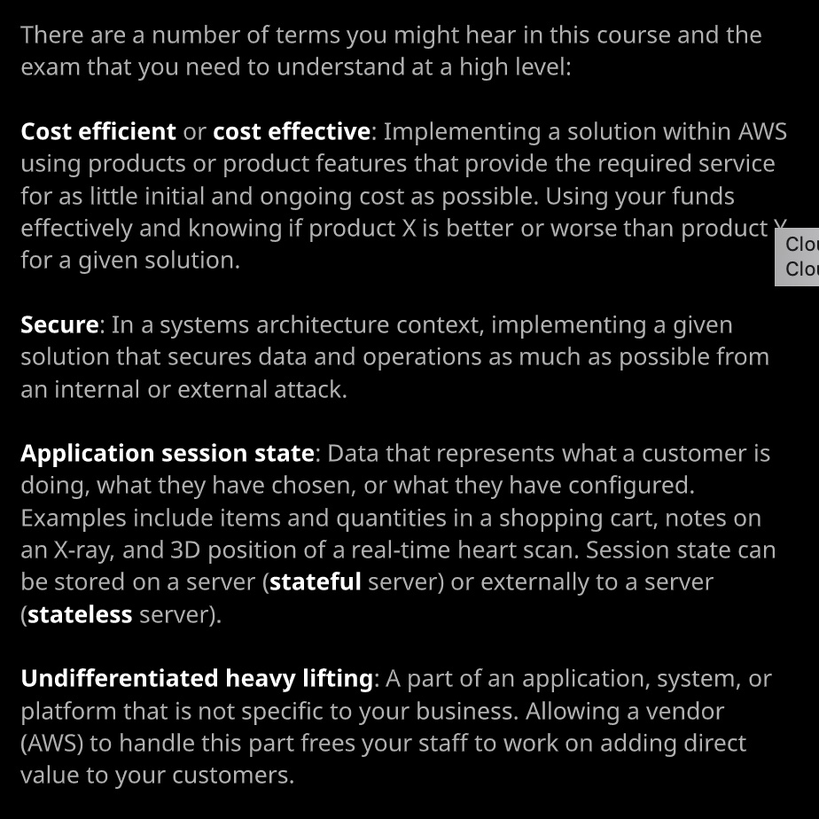


- **总结**：这部分没有涉及AWS具体的服务，但是对围绕架构需要理解的概念，想法，都做了一个很好的说明。很有用的内容。这是作为架构师的思维方式的问题，是更高层面。例如，再设计应用的时候，应该按照分层的方法进行设计。这样每个层次都可以单独进行扩展。应用如果设计成松耦合，会有更好的灵活性，性能等。另外，对DR部分，用了一张很简单的图就说明了RPO和RTO的概念。针对加密，通过对一个文本文件的机密，演示了对称和非对称加密的方法，优点和缺点。小测验顺利通过，对identity，principle的概念做了加深。