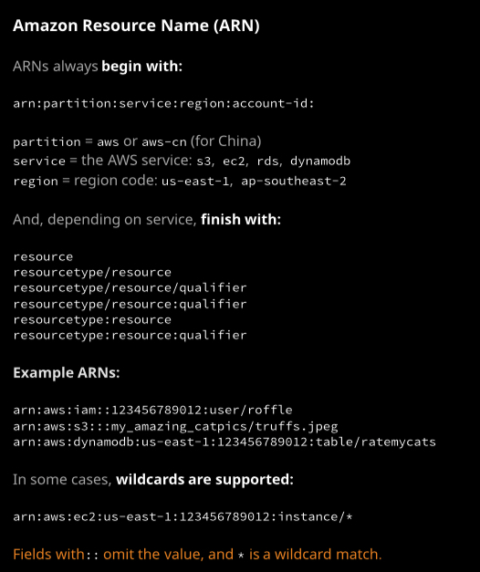
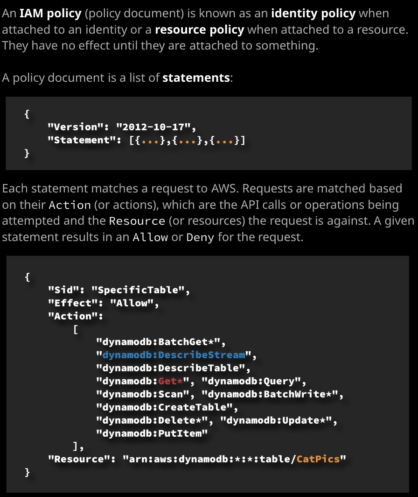
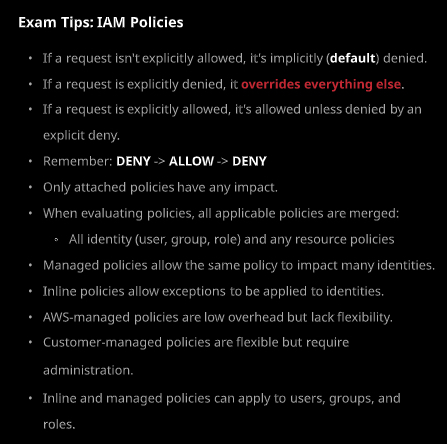
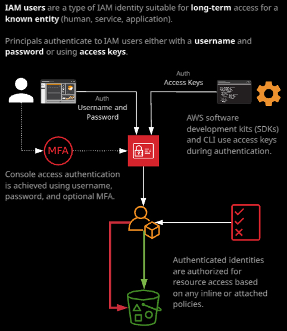
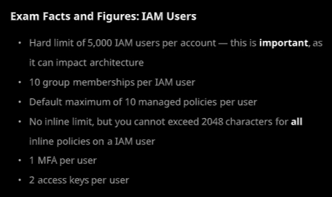
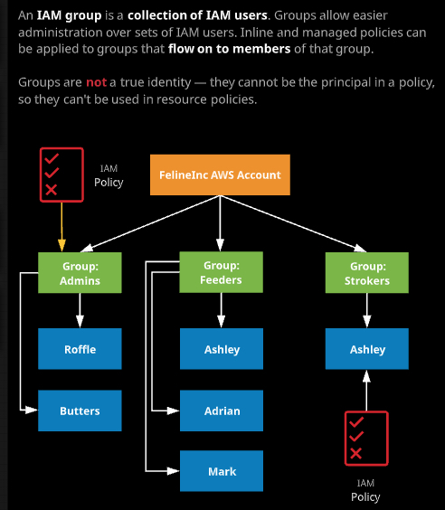
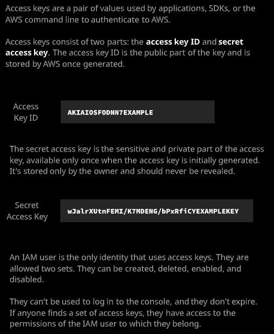

---

layout: post
title: AWS CSA - Associate Level 学习笔记 - Week 1 - Part III
img: image-20190830170450834.png
---

#### Day 4 - Indentity and Access Control

- ARN: Amazon Resourse Name

  ###### 

- User：对应单个的用户，通过policy设定权限
- Groups: 把用户分组；通过policy设定权限
- Roles：不能用role登录。通过policy设定权限，针对资源设定
- IAM Policy
- 缺省情况下，是没有任何访问权限的。

### Day 5

- IAM Policies: 一个声明列表，一个JSON文档。只有当附加到某个对象上的时候才能发挥作用。例如附加到identity上，就成了identity policy，如果附加到资源上，就成为了资源的policy。

  

  


例如上面的例子，就是一个statement，通过key:value的pair定义。Allow对应到具体允许的这些dynamodb的操作，针对的对象时Resource指定的ARN资源。

- inline policy
- amazon-managed policy
- customer-managed policy

Policy的总结：

###### 

### Day 6

- IAM Users
  - 用户的认证使用用户名和密码，和可选的MFA
  - 而SDK和API的认证使用access key
  - 每一个account下可以有多个IAM user
  - 通常情况下，不建议使用最初创建的AWS root user来做日常的管理，而是在这个account下面创建用户，并附加administrator的权限，用该用户进行日常管理。

###### 

IAM 用户有很多的属性。

例如可以通过permission，设置inline 权限；或者通过IAM policy设置。属于哪个组。

也可以设置tag，设置包括MFA在内的安全认证等。

###### 

- IAM Groups: [IAM Groups not real identities](https://docs.aws.amazon.com/IAM/latest/UserGuide/id_groups.html) `Note that a group is not truly an "identity" in IAM because it cannot be identified as a Principal in a permission policy. It is simply a way to attach policies to multiple users at one time.`

AWS在评价一个用户拥有什么样的权限时，会评价该用户的inline policy和managed policy，以及该用户所属的所有组的inline policy和managed policy。

###### 


### Day 7

- Access Keys: 一对key。Access keys consist of access key IDs and secret access keys. Access keys are the long-term credentials used to authenticate to AWS for anything but the console UI. This lesson walks through the architecture and discusses some key exam-relevant points.
  - Access Key IDs
  - Secret access keys：一旦生成，不能改变。只能重新生成新的。

###### 

- IAM User的login URL可以定制，给一个容易记的名字，而不是用account id。

- 这一部分通过Demo演示了如何添加一个用户，并设置MFA，设置Access Key。然后演示了如何在三种OS上安装`awscli` 工具，并通过`aws configure`进行配置，输入该用户的access key ID, access keys, region, output format(json)， 然后使用命令`aws s3 ls`来测试。

  - **Windows**

    - GUI 安装

  - **Linux**

    ```bash
    sudo yum install epel-release
    sudo yum install python-pip
    sudo pip install awscli
    ```

  - **Mac**

    ```bash
    /usr/bin/ruby -e "$(curl -fsSL https://raw.githubusercontent.com/Homebrew/install/master/install)"
    brew install awscli
    ```

[AWS Command Line Interface](https://aws.amazon.com/cli/).