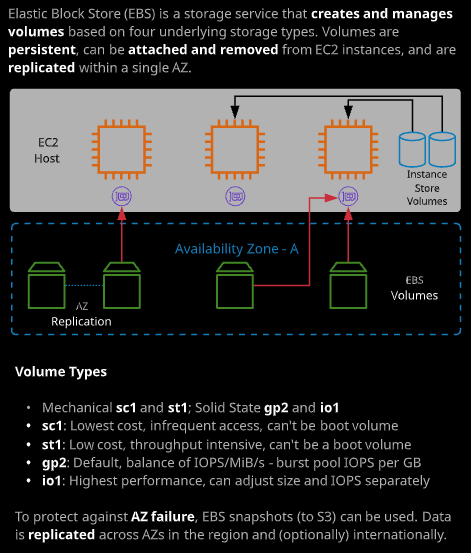

### Day 8

- IAM roles: role的概念很容易理解，但是难点在于掌握什么时候在哪里使用。


一个identity可以assume 一个role，并获取这个role的角色。

每个role有两个policy：

- trust policy: 控制谁可以assume这个role
- permission policy：和其他的IAM policy设置的permission类似

例如，下面的policy就是允许EC2可以assume这个role。

```json
{
  "version": "2012-10-17"
  "Statement": [
  	{
  		"Effect": "Allow",
  		"Principal":{
  			"Service": "ec2.amazonaws.com"
			},
			"Action": "sts:AssumeRole"
		}
  ]
}
```

简单讲，roles，允许identity可以临时的assume一个身份，当获取了身份后，STS会分配一个临时的access key用以访问permission policy里面规定的权限的资源。

- 什么时候用，什么时候不能用？
  - 当需要一个login 的account的时候，不能使用role。roles没有用户名和密码，没有access keys等。
  - roles可以用在很多地方，比如当有很多的用户的时候，可以让这些用户assume 角色，而不需要为每个用户创建一个用户

- AWS Organizations: 

  AWS Organizations is useful for businesses that need to manage multiple accounts. It provides the following features:

  - Consolidated billing
  - Service control policies (SCPs)
  - Account creation
  - Simplified role switching

###### 

当创建organization时，第一个account会被转换成`Master Account`。Master Account只能有一个，并且不能被限制权限。

可以创建两种类型的organization：

1. All features
2. Consolidate billing only

在organization中的其他账户都是member account。如上图中的account [1-4]。

所有购买的services，都可以分享到整个Organization。

- Service control policies：policy设置后，从这层开始一直到树的最末端，该policy都生效。

###### 

- 角色切换 - Role Switching

  ##### 

### Day 9 - EC2 计算资源

EC2是AWS的核心服务之一。虽然其他的公司可以提供虚拟机计算，但是EC2可以提供和AWS中其他的资源交互的功能和机制。这是EC2的强项之一。其实是运行在EC2 host上面的虚拟机，只占用物理机的一个部分资源。

通过AWS创建EC2之前，先创建了key pair。这个key pair是两部分。一个是key 和fingerprint部分，一个是key.pem。key.pem是只有在创建的时候有机会下载。

EC2是运行在一个AWS的网络里面，VPC。所以创建EC2之前需要创建VPC。

EC2是运行在一个特定的AZ中的。

EC2的存储，可以使用两种类型：

- Instance Store Volume：高性能，临时，非持久化的卷。数据会丢失，例如HA，EC2在其他的host启动。
- EBS Volume（Elastic Block Storage）: 可持久化，有快照

###### 

EC2 is ideal for:

- Monolithic applications
- Consistent, long-running compute scenarios
- Applications that require full OS/runtime installations
- Services, endpoints, and/or applications that require high availability

EC2的Instance有它的生命周期，如下图。

###### 

[EC2 文档](https://docs.aws.amazon.com/AWSEC2/latest/UserGuide/concepts.html)

- Instance Family，Type和Sizes

- **具体如何选择呢？**客户要知道自己的大概的计算，内存，存储的需求才能在最初选择比较接近的资源来使用。并且提供一定的多余的资源。当然也可以选择相对较小的资源，通过scale out功能在需要更多需求的时候再进行扩充。[EC2 Instance Type](https://aws.amazon.com/ec2/instance-types/)

  在官方主页对这个问题有这样一段说明：

  > ## Measuring Instance Performance
  >
  > Why should you measure instance performance?
  >
  > Amazon EC2 allows you to provision a variety of instances types, which provide different combinations of CPU, memory, disk, and networking. Launching new instances and running tests in parallel is easy, and we recommend measuring the performance of applications to identify appropriate instance types and validate application architecture. We also recommend rigorous load/scale testing to ensure that your applications can scale as you intend.
  >
  > Considerations for Amazon EC2 performance evaluation
  >
  > Amazon EC2 provides you with a large number of options across ten different instance types, each with one or more size options, organized into six distinct instance families optimized for different types of applications. We recommend that you assess the requirements of your applications and select the appropriate instance family as a starting point for application performance testing. You should start evaluating the performance of your applications by **(a) identifying how your application needs compare to different instance families (e.g. is the application compute-bound, memory-bound, etc.?), and (b) sizing your workload to identify the appropriate instance size.** There is no substitute for measuring the performance of your full application since application performance can be impacted by the underlying infrastructure or by software and architectural limitations. We recommend application-level testing, including the use of application profiling and load testing tools and services.

  ###### 

### Day 10

- EC2 Storage

  - Instance Store Volumes: 在EC2所运行的host主机内部，临时的存储
  - EBS：SAN存储，block，具有持续性

  ###### 

- 注意：EC2在console中，instance级别的start/stop/restart和 EC2中的OS级别的相同操作是不同的。
- 这里做了一个实验，当在instance级别把EC2的实例stop后，再重新start，这时EC2会在不同的硬件上启动。也就意味着instance store volumes的数据就不存在了。

> # Amazon EC2 Instance Store
>
> An *instance store* provides temporary block-level storage for your instance. This storage is located on disks that are physically attached to the host computer. Instance store is ideal for temporary storage of information that changes frequently, such as buffers, caches, scratch data, and other temporary content, or for data that is replicated across a fleet of instances, such as a load-balanced pool of web servers.
>
> An instance store consists of one or more instance store volumes exposed as block devices. The size of an instance store as well as the number of devices available varies by instance type.
>
> The virtual devices for instance store volumes are `ephemeral[0-23]`. Instance types that support one instance store volume have `ephemeral0`. Instance types that support two instance store volumes have `ephemeral0` and `ephemeral1`, and so on.

这里讲的更明白：

> ## Instance Store Lifetime
>
> You can specify instance store volumes for an instance only when you launch it. You can't detach an instance store volume from one instance and attach it to a different instance.
>
> The data in an instance store persists only during the lifetime of its associated instance. If an instance reboots (intentionally or unintentionally), data in the instance store persists. ==However, data in the instance store is **lost** under any of the following circumstances:==
>
> - The underlying disk drive fails
> - The instance stops
> - The instance terminates
>
> Therefore, do not rely on instance store for valuable, long-term data. Instead, use more durable data storage, such as Amazon S3, Amazon EBS, or Amazon EFS.
>
> ==When you stop or terminate an instance, every block of storage in the instance store is **reset**.== Therefore, your data cannot be accessed through the instance store of another instance.
>
> If you create an AMI from an instance, the data on its instance store volumes isn't preserved and isn't present on the instance store volumes of the instances that you launch from the AMI.
>
> If you change the instance type, an instance store will not be attached to the new instance type. For more information, see [Changing the Instance Type](https://docs.aws.amazon.com/AWSEC2/latest/UserGuide/ec2-instance-resize.html) .

- EBS：在选择时，根据自己的需求来选择volume type。SSC，HDD，两种类型是主流。然后看是需要更多的IOPS还是吞吐量。另外，根据cost，访问的频率。
- EBS的IOPS和吞吐量是有最大上限的，吞吐量上限：1750MiB/S；IOPS上限：80,000 IOPS。如果需要更多，就只能使用Instance Store Volumes。而ISV是临时性的，会丢失数据的。这点务必引起注意。
- EBS是运行在AZ中的，所以在创建的时候，要确认好需要使用该EBS的EC2 Instance在哪个AZ。只有处于相同AZ的才可以attach EBS卷。

[EBS 卷文档](https://docs.aws.amazon.com/AWSEC2/latest/UserGuide/EBSVolumeTypes.html)