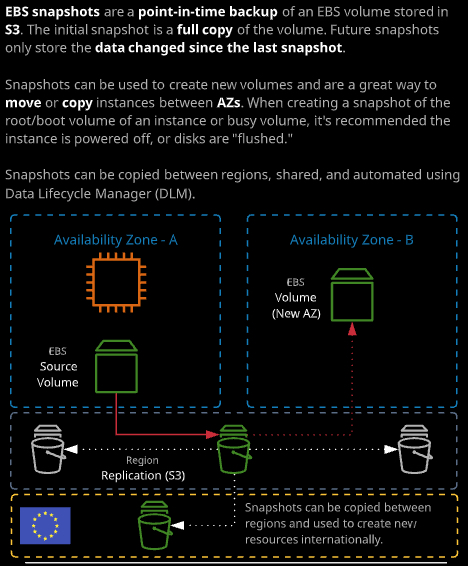
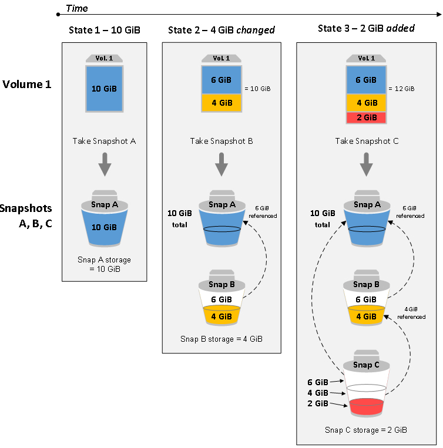
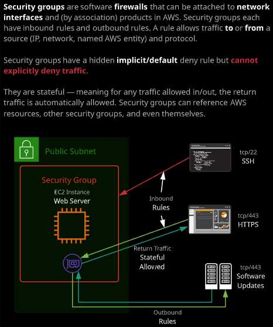
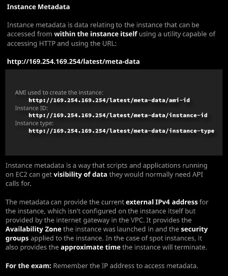
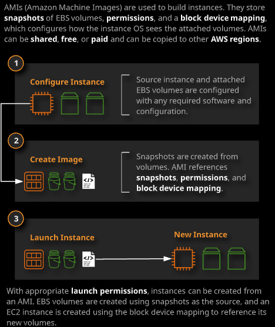
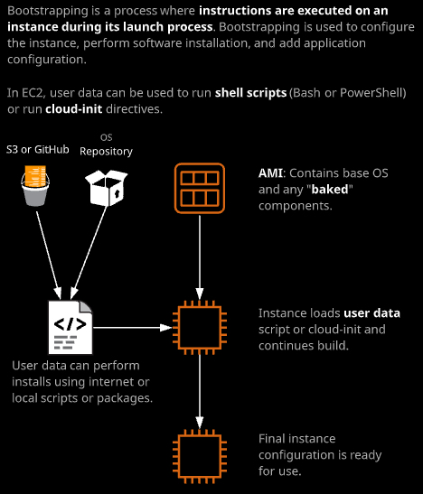
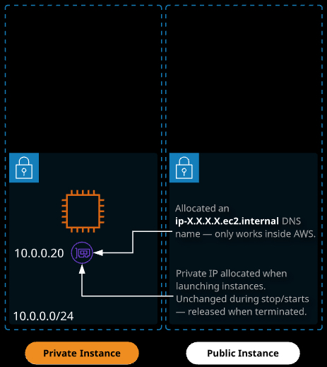
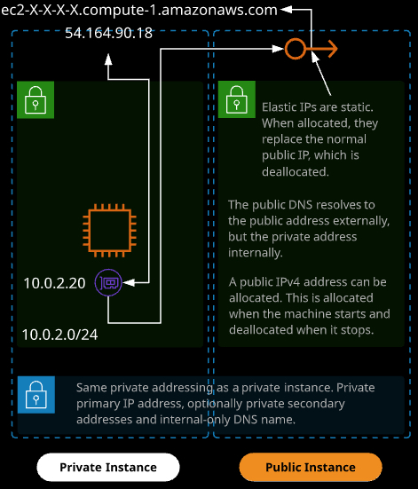
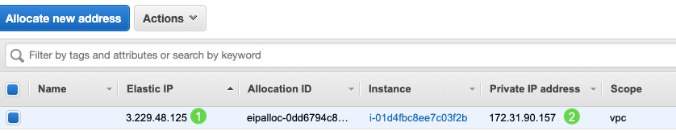
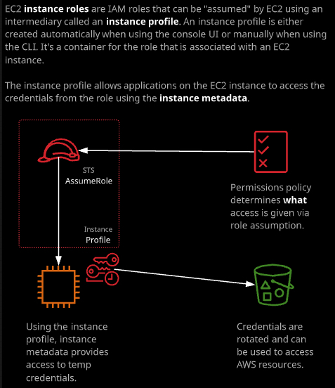

### Day 11

- EBS Snapshots：快照，和NetApp的快照有很大不同。第一次快照拍的是point-in-time的**全拷贝- Full Copy**，不是根节点的复制，所以会比较慢。后续的快照是和上次快照之间的数据差。另外，快照存放在S3中，而不是EBS。EBS本身只能在一个AZ中，但是可以利用快照来创建新的卷，在不同而AZ之间移动和拷贝实例。

- 虽然是增量备份，删除中间的快照并不会让后面拍的快照数据丢失。

- 为EBS卷拍过快照之后，利用该快照创建新的卷，这个新的卷就已经具备了和快照内相同的数据。包括文件系统。[How EBS Snapshots works](https://docs.aws.amazon.com/AWSEC2/latest/UserGuide/EBSSnapshots.html)

- 快照是在Console中拍的，所以并不是application一致性的快照。如果想要保证数据，application的一致性，需要flush 内存，或者停止instance。

- 虽然快照是存放在S3，但是如果从console访问S3，无法看到快照的数据。

- 最佳实践：为root volume拍快照。

- 在利用快照创建新的卷时，可以选择不同的AZ。当然，要利用这个卷，需要在新的AZ中具备EC2的Instance。因为在原来的AZ中的EC2也同样不能够跨AZ。

- 利用Snapshot的copy功能，可以选择不同的region，从而实现卷的跨区域功能。

- 快照的生命周期可以使用DLM（Data Lifecycle Manager）来实现。后续章节会再介绍。

  ###### 

快照的工作原理：

##### 


- Security Group - EC2级别的虚拟防火墙

  - Security groups are an essential part of the EC2 and VPC security toolset. They operate like a virtual firewall, controlling traffic originating from or destined for a network interface (or an instance).

    [User Data](https://github.com/linuxacademy/content-aws-csa2019/blob/master/lesson_files/03_compute/Topic1_Fundamentals/05_SecurityGroups/userdata1.txt)

    ###### 

  - security group由group ID唯一标识；由 ==inbound rule== 和 ==outbound rule== 定义；必须绑定到一个VPC。Security Group绑定在一个EC2实例的网卡上。

  - 隐藏rule：缺省的，deny。

  - Security Group无法指定deny rule，只能设置允许的rule。

  - stateful的，也就是允许出去的规则，也允许inbound的trafic。而Network Access Control 不是stateful的，所以需要两条规则规定inbound和outbound。

  - source的部分还可以指定其他的Security group。例如所有的server 绑定了特定的security group的都可以互相之间用任何方式通讯。

- Instance Metadata：实例的元数据

  - 这里的获取meta data的URL需要记住。

    [http://169.254.169.254/latest/meta-data/](http://169.254.169.254/latest/meta-data/)

  - 例如在EC2中通过命令`curl -s http://169.254.169.254/latest/meta-data/`就可以获取该EC2 实例的meta data。

    `[ec2-user ~]$ curl http://169.254.169.254/latest/meta-data/ami-id `

    `ami-0abcdef1234567890`

  - [EC2 Instance Meta-data资料](https://docs.aws.amazon.com/AWSEC2/latest/UserGuide/ec2-instance-metadata.html)

  ###### 

- Lab: 可以在创建EC2的时候，在Advanced details里面添加EC2启动时执行的指令。例如下面的代码，就可以安装好httpd等服务，并且获取图片，设置好web server并启动。

  ```bash
  #!/bin/bash
  yum update -y
  yum install -y httpd
  yum install -y wget
  chkconfig httpd on
  cd /var/www/html
  wget https://raw.githubusercontent.com/linuxacademy/content-aws-csa2019/master/lab_files/03_compute/creating_an_ec2_instance/index.html
  wget https://raw.githubusercontent.com/linuxacademy/content-aws-csa2019/master/lab_files/03_compute/creating_an_ec2_instance/catanimated.gif
  wget https://raw.githubusercontent.com/linuxacademy/content-aws-csa2019/master/lab_files/03_compute/creating_an_ec2_instance/rainbow.gif
  wget https://raw.githubusercontent.com/linuxacademy/content-aws-csa2019/master/lab_files/03_compute/creating_an_ec2_instance/penny.jpeg
  wget https://raw.githubusercontent.com/linuxacademy/content-aws-csa2019/master/lab_files/03_compute/creating_an_ec2_instance/roffle.jpeg
  wget https://raw.githubusercontent.com/linuxacademy/content-aws-csa2019/master/lab_files/03_compute/creating_an_ec2_instance/truffs.jpeg
  wget https://raw.githubusercontent.com/linuxacademy/content-aws-csa2019/master/lab_files/03_compute/creating_an_ec2_instance/winkie.jpeg
  service httpd start
  ```

  ### Day 12

  - AMI: 

  AMIs (Amazon Machine Images) are used to launch instances in AWS. AWS supplies AMIs that cover most standard operating systems (Linux and Windows), and AMIs containing commercial software are available on the AWS Marketplace. Additionally, custom AMIs can be created by AWS customers and used directly or shared with other accounts.

  ###### 

  - 创建AMI的步骤：
    - 创建一个EC2 Instance
    - Stop Instance
    - 右键点击Instance，选择Image-> Create Image
    - 系统会创建一个Snapshot，然后添加所有的Volume，创建AMI
    - AMI是一个指向原有的Snapshot的Container
    - 可以为AMI设置权限，Public，或者Private
  - 使用AMI
    - 选择创建好的AMI，选择launch
    - 然后会弹出EC2创建的画面，只不过是从计算资源开始，而不是从Image开始
    - 后面的设置和选项都和普通的EC2 Instance的创建相同
  - AMI，可以对现有的Image做一些调整，设置的改变，如果以后需要重复使用，就可以使用AMI的方式打包，然后直接从这里开始部署实例。而不需要每次都从开始进行。

- Bootstrap:

  Bootstrapping is the process of providing "build" directives to an EC2 instance. Bootstrapping in EC2 uses user data and can take in shell script-style commands or cloud-init directives.

  ###### 

  - AMI无法做任何动态的设置，所有的设定都是预先设定好的。
  - Bootstrap可以在创建Instance时，可以加上动态的设置。可以通过两种方式：
    - Shell Scripts
    - cloud-init: [cloud-init doc](https://cloudinit.readthedocs.io/en/latest/)

- Instance ENI, IP and DNS

  - ENI: EC2 Network Interface

  - Private Instance: 没有public IP的Instance，只拥有private IP。Private IP会分配到ENI上，并且不会随着Instance的状态改变。

    ###### 

  - Public Instance： 拥有public IP，可以从Internet访问到的Instance。Public IP会发生改变，例如stop/start Instance；但是restart instance不会改变public IP。Private IP的部分和Private Instance相同。

    ###### 

  - 从EC2的角度看，public IP address并不属于EC2，所以从ifconfig看，只能看到private IP。==Internet Gateway==实现的是从==private IP <---> public IP==之间的转换。

  - 所以，如果希望EC2 Instance具备不变的public IP和DNS名称，就不能使用Public IP，而是使用Elastic IP。Elastic IP是预先从AWS的IP地址池中分配一个地址，然后分配给相应的EC2 Instance。该IP地址是独立于EC2的。

  - Elastic创建后，并且和instance 做了associate后，会替换所有动态的可变的public IP，并且Private IP也会改变成在associate Elastic IP地址时指定的private IP。这个private IP会和Elastic IP之间做mapping。

  

- Instance Roles

  Instance roles are IAM roles that can be associated with EC2 instances using instance profiles. 

  ###### 
  - Demo:

    - 创建一个EC2 Instance

    - 创建了一个S3 Bucket

    - 连接EC2 Instance，使用`aws s3 ls` , 因为没有运行`aws configure` 命令失败。当然可以通过配置access key，可以访问S3。但是这样有风险。

    - 此时 Instance Profile登场了。Instance Profile是一个容器，允许EC2 instance assume role。

    - 在IAM里面创建一个Role，选择AWS Services，EC2

    - 设置permission，这个例子里面给了S3ReadOnly的权限

    - 设置Role的名称，创建好role

    - 然后需要把这个role和EC2 instance 链接起来

    - Instnce Settings，attach/replace IAM role，选择刚才创建的role（**这里其实选择的是instance profile，只不过看起来是role**）

    - 此时，这个EC2会assume这个role，也就是可以使用`aws s3 ls`就可以看到bucket的信息了。

      