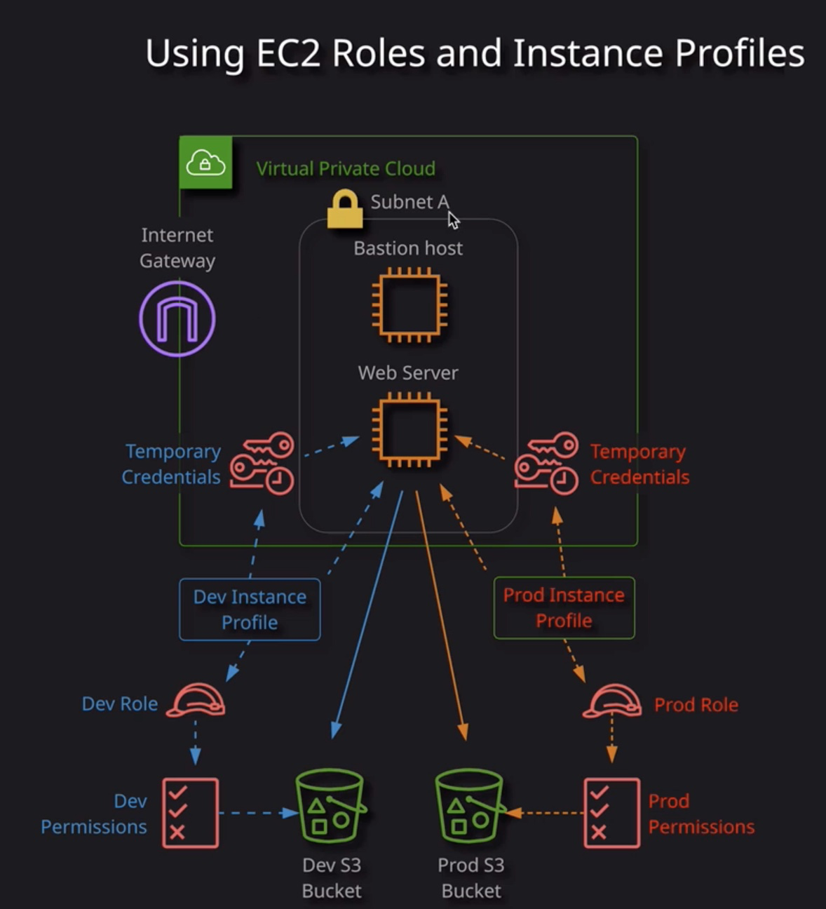
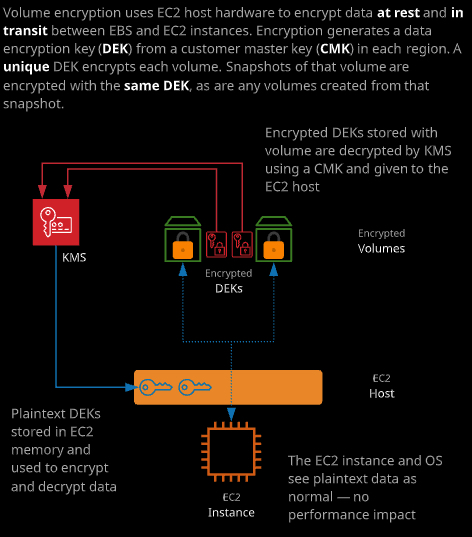

### Day 13

- Hands-On lab

  - Instance Role: what I can do?
  - Instance Profile: Who am I?

  

- EBS Volume and Snapshot Encryption

  EBS volume encryption adds encryption at rest and in transit to EC2 storage.

  在account的设置里面，可以对EBS Volume的加密进行设置。该设置是针对账号在设置这个选项时所在的Region的。生效后，这个账号在该region所有新创建的EBS卷都会加密。

  EBS卷的加密是通过EC2来完成的，并且不会对EC2造成性能影响。EC2在读取加密的数据时，会进行解密。

  Key的部分都是通过KMS来完成的。有关KMS后续还会有培训内容。

  ###### 