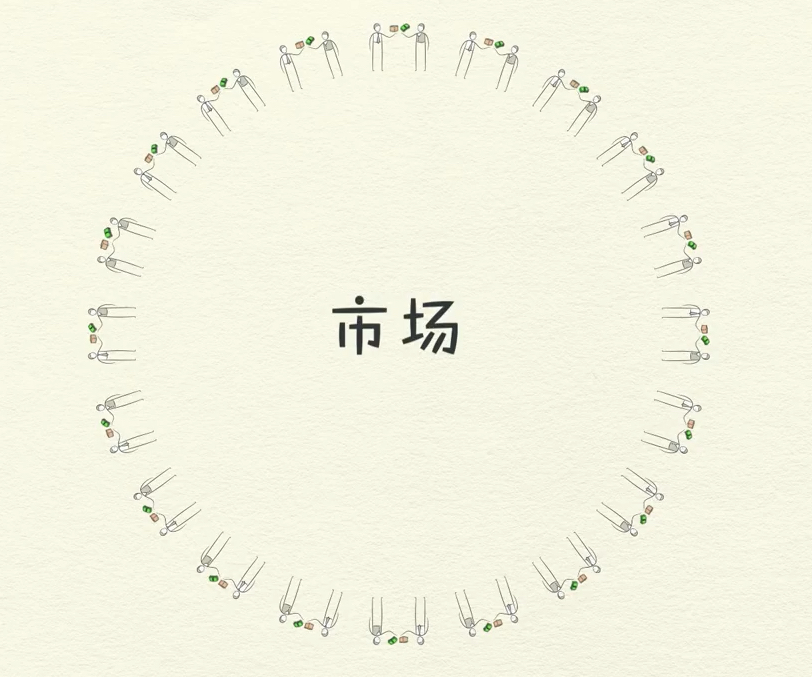
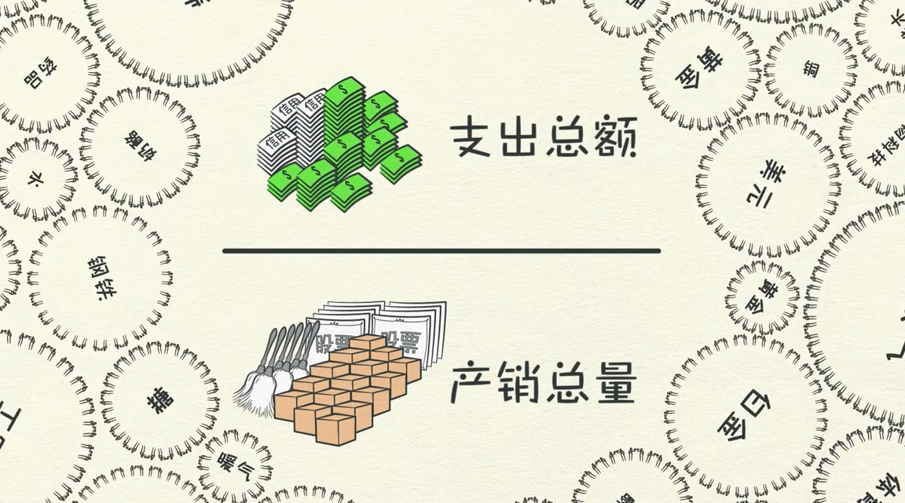
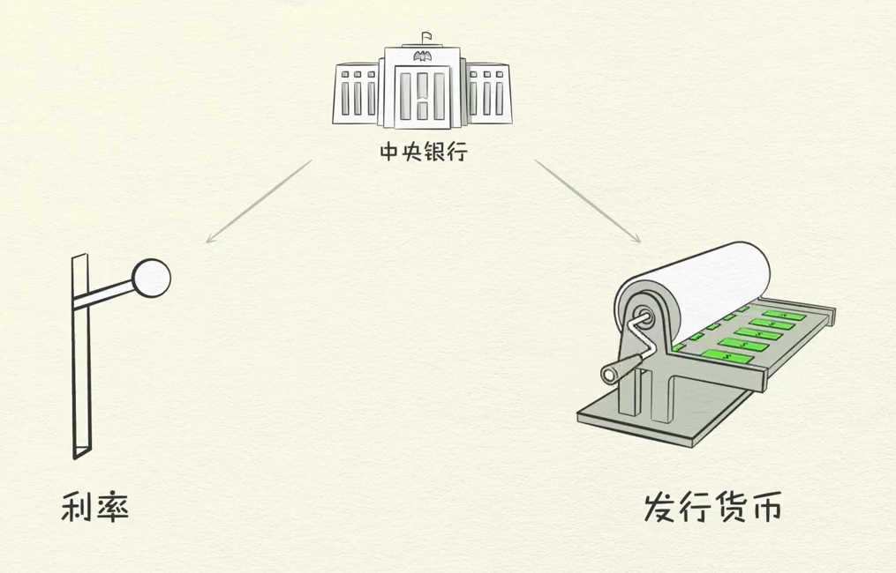
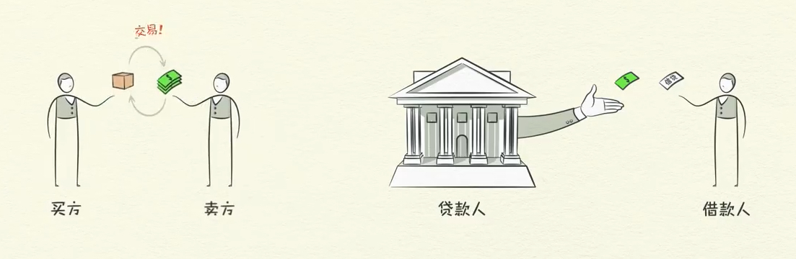
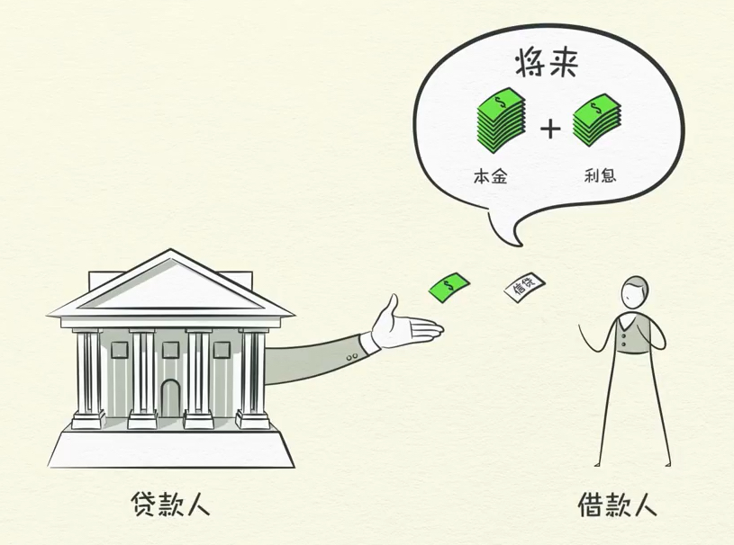
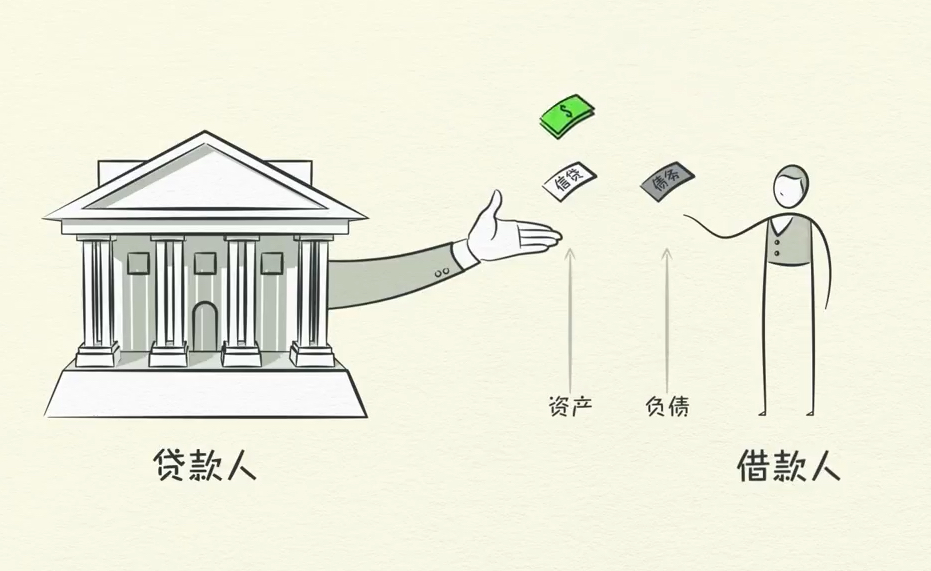
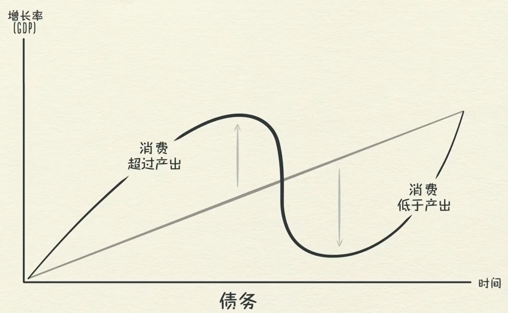
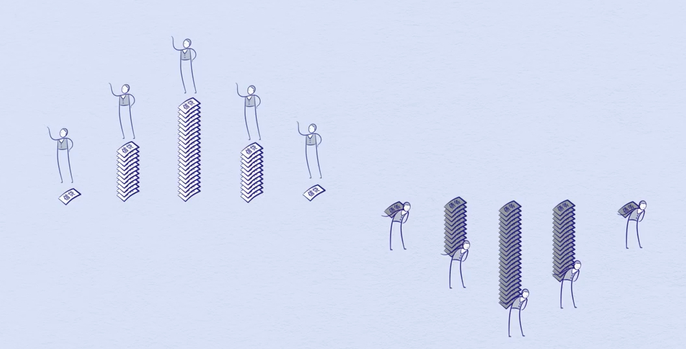

#### 《经济机器是怎样运行的》

交易是经济的最基础零件；理解了

生产效率

短期和长期债务

不断重复

 交易：

- 买方：货币 或者 信用
- 卖方：商品，服务或金融资产

`货币 + 信用 = 支出总额 `

**支出总额是经济的驱动力**

`支出总额/产销总量 = 价格` 

一个市场由所有买卖同一种商品的买方和卖方组成。

例如小麦市场，汽车市场，股票市场，钢铁市场等等等等。

经济就是全部市场的全部交易组成。

把所有市场的交易的支出总额，产销总量计算出来，就得到了经济的全部信息。

个人，机构，政府都在用类似的方式从事交易。

政府是最大的买方和卖方。有两个主要的组成部分，中央政府和中央银行。

- 中央政府：收税和花钱。
- 中央银行：控制经济中的货币和信贷数量。通过利率，和发行货币

**信贷**：经济中最重要的组成部分。因为它是经济中最大也最为变幻莫测的部分。

贷款人：想钱生钱。

借款人：想买现在无法买到的东西。 

贷款利率的高低决定了贷款人的多少，贷款数量的多少。

利率高，贷款成本变高，贷款人变少。

利率低，贷款成本低，贷款人增加。

<u>如果借款人承诺偿还债务，而贷款人也相信，那么信贷就产生了。</u>

信贷看似简单，实则复杂。因为信贷一旦产生，立即成为债务。

**经济周期**

借款人的偿还能力增加，例如收入增加，会让贷款人更愿意贷款给他。因而提高了信贷。而借款人因为有更多的贷款，就可以有更多的支出，这些支出通过交易变成了别人的收入。而下一个人的收入又会产生新的交易，或者新的信贷，以此类推。这样的循环往复，产生了经济周期。

生产率在场期内最关键。

信贷在短期内最重要。

原因是，生产率不会剧烈波动，所以不是经济起伏的重要因素。 

但是信贷是这样的动力。因为可以通过信贷让消费超过产出。

所以经济的上下起伏不是取决于人们多么善于创新和勤奋工作，而是取决于信贷的多少。

如果没有信贷，就只能靠生产率来提高收入。

因而提高经济的唯一办法就是提高生产率。

借债就是提前消费。

