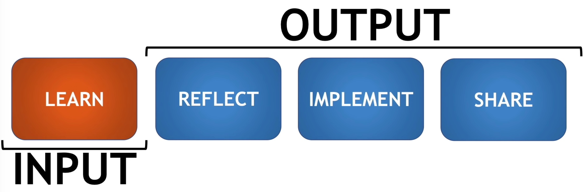
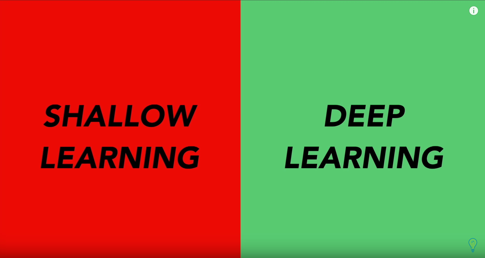

> "For true mastery, you need to focus more on the ==OUTPUT==, rather than the INPUT. -Nishant Kasibhatla"

> "A mind taht is stretched by a new experience can never go back to its old dimensions - Oliver Wendell Holmes "

> "You learning ability decides your earning capacity - Nishant Kasibhatla"

**Learn (INPUT) - [Reflection - Implement - Share] (OUTPUT)**

$1X INPUT +  2X OUTPUT (minimum)$

**我的学习心得：**

- 确保高质量的INPUT
- 需要花更多的时间在OUTPUT上面
- 从Shallow Learning（肤浅的学习）模式 切换到 Deep Learning (深度学习)

- 简单讲，就是学以致用，再加上分享，进一步加深印象，理解，让这些知识变成自己的
- 如果学习的知识不使用，就是纯粹的一种娱乐作用，学过之后就忘记了，丢掉了。
- 学习过程中，需要single task。专注在学习这一件事情上。因为输入的质量，决定了后面的OUTPUT的质量

##### Reflection:

在学习之后，停下来，回顾一下我的take away是什么，我如何在工作和生活中使用这些知识。

##### Implement:

停下来，把可以用到的知识写下来，做成action，放到你的calendar里面。让自己有所行动。A lousy action is better than no action.

#### Share:

The best way to learn something is to teach it.

