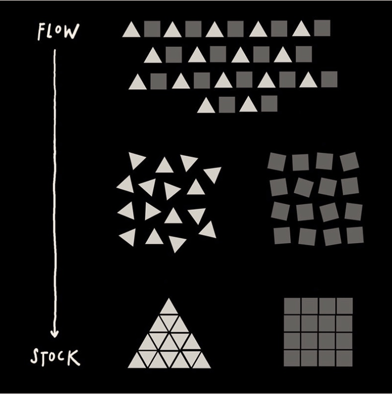
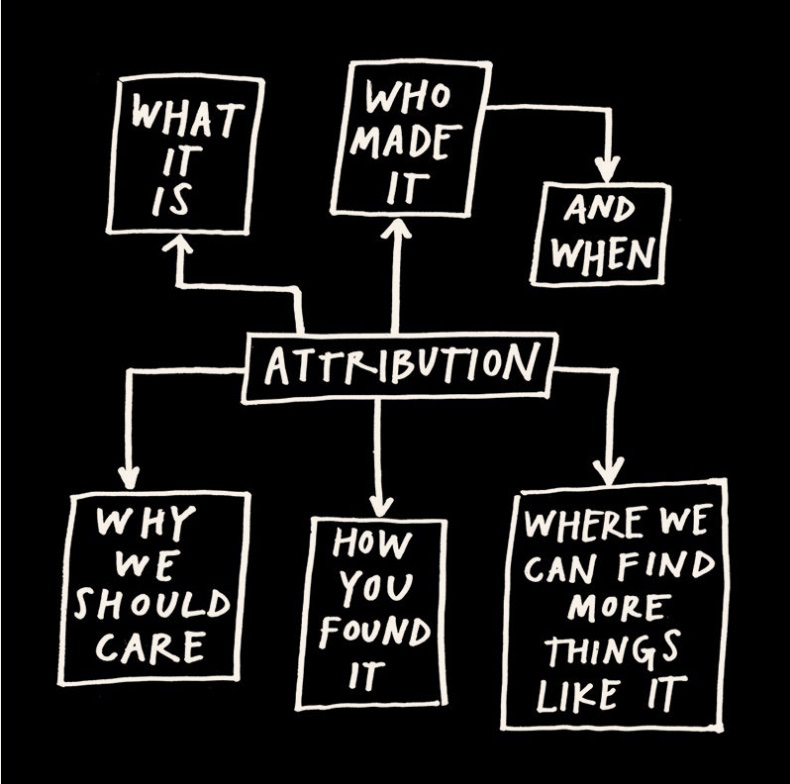
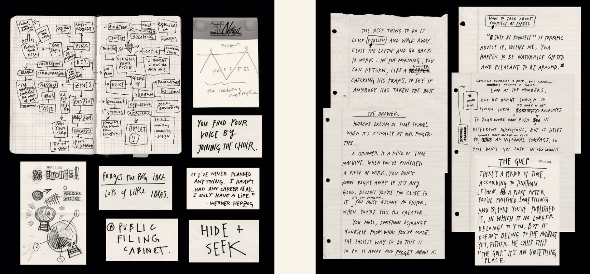

#showyourwork

### I: Input 阶段

一种新的操作。

**关键词:** Sharing,分享你的项目，你的工作进度，新的，利用网络，开放，吸引观众，永无终结的项目

可期待的输出：

你的雇主可以通过你的博客了解你，可以建立更多的连接，更多的人支持你。可以开发副业等。或者只是让你把时间和精力花费在你感兴趣事情上。

>“All you have to do is show your work.”

#### 1. You Don't have to be a genius

>“creativity is always, in some sense, a collaboration, the result of a mind connected to other minds.”

**关键词：**==scenius==

想想你可以贡献什么，而不是其他人能为我做什么。

Be an Ameteur - 做一个业余者

> “When Radiohead frontman Thom Yorke was asked what he thought his greatest strength was, he answered, ==“That I don’t know what I’m doing.”== Like one of his heroes, Tom Waits, whenever Yorke ”

#### You can't find your voice if you don't use it.

> “Talk about the things you love. Your voice will follow.”

 #### 2. Think of Process, not product

在数字时代，重要的是把原来在幕后的过程可以通过各种社交媒体随时随地分享。而不仅仅是在你完成一件作品或者一个项目之后，展示成果。

开始一个工作日志：在笔记本上记录你的想法，或者录音。把你工作的过程通过照片记录下来，拍视频，这不是关于艺术，而是记录你的进度。手机，随身带一个笔记本，就够了。

#### 3. Share Something Small EVERY Day

> “Put yourself, and your work, out there every day, and you’ll start meeting some amazing people.”
> —Bobby Solomon”

以天作为单位记录你的进程。在一天结束的时候，拿出你的日志找到可以分享的部分。不同的阶段所分享的内容和角度也有所不同。例如在早期阶段，可以着重在是什么激发了你的想法。

这个每天分享的内容可以是任何形式。博客，Youtube video，等等。

"Send out a Daily Dispatch"

> “One day at a time. It sounds so simple. It actually is simple but it isn’t easy: It requires incredible support and fastidious structuring.”
> —Russell Brand”

**"So What?"**

针对要分享的内容，写下来，放1天，第二天重新审视是否依然值得分享。使用So what来发现这些东西的价值。

是否有用？是否有趣？

分享的是你的 **Work**。 

> If you work on something a little bit every day, you end up with something that is massive.

不但是积少成多，还可以从不断的分享中不断找到**规律，模式**，从而重新构建更加大的成果。

注册一个域名，构建一个网站，博客，让你的网站和你一起成长。不断积累。

你可以有完全的控制权，不用担心被别人操控，不用做出让步。

"Build a good name. **Keep your name clean**. Don't make compromises. Don't worry about making a bunch of money or being successful. **Be concerned with doing good work**...and if you an build a good name, eventually that name will be its oen currency."

#### 4. Open up your cabinet of curiosities

> “The problem with hoarding is you end up living off your reserves. Eventually, you’ll become stale. If you give away everything you have, you are left with nothing. This forces you to look, to be aware, to replenish. . . . Somehow the more you give away, the more comes back to you.”
> — Paul Arden”

收集和创造之间并没有太大差别？？？

你的品位，你的收藏，你的作品，创作相互激发，相互连接。

> "Do what you do best and link to the rest."
>
> - Jeff Jarvis

如何分享他人的作品？

#### 5. Tell good stories

给你的作品讲一个好故事。

一个好故事最重要的就是结构。一个好的故事结构应该是简洁，有力富有逻辑性。

#### 6. Teach what you know

烤肉店的故事。

烤肉的过程其实并不复杂，但是需要常年累月的积累，才能做好。店主把烤肉的方法交给了很多人，包括自己的店员，但是因为这些人没有足够的联系依然无法达到店主的水平。

当你掌握了一项新的技能后，就开始学习新的技能。

不守旧，在现有的基础上不断地学习，积累，突破。

> “Whenever Picasso learned how to do something, he abandoned it.”
> — Milton Glaser”

后面还谈到了如何应对负面的评价，如何应对批评，苛责。比如关掉评论功能。

### II: Reflection 阶段

这本书里面有很多不错的内容。

- 保持初学者的心境，不守旧，这也是保持一种空的状态，能够接纳新的事物，思想。这一点可以适用于工作，生活的方方面面。我接下来要尝试这种方法。这也可以帮助我用新的视角看待旧的事物。
- **"Share Your Work"**，这句话我觉得非常棒。不是去分享哪些无聊的东西。
- 如果你不分享，不发出自己的声音，别人怎么找到你？
- 分享过程，分享值得分享的东西，怎么甄别呢？用"So What?"。
- 有一个好的故事，好的故事需要有好的结构。过去，现在，未来。
- 对待他人的工作成果就如同对待自己的，给他人相应的credit。
- 书后面的书单我觉得不错，可以挑选一些自己看。
- 幕后的素材，思路等我觉得很好，可以借鉴。

**“BOOKS ARE MADE OUT OF BOOKS.” — CORMAC MCCARTHY**

- Brian Eno, A Year With Swollen Appendices
- Steven Johnson, Where Good Ideas Come From
- David Byrne, How Music Works
- Mike Monteiro, Design Is a Job
- Kio Stark, Don’t Go Back to School
- Ian Svenonius, Supernatural Strategies for Making a Rock ‘n’ Roll Group
- Sidney Lumet, Making Movies
- P.T. Barnum, The Art of Money Getting”

