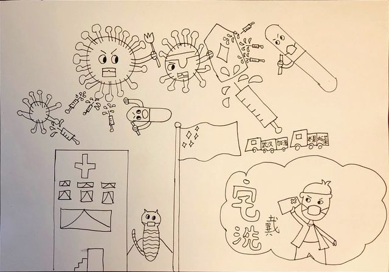
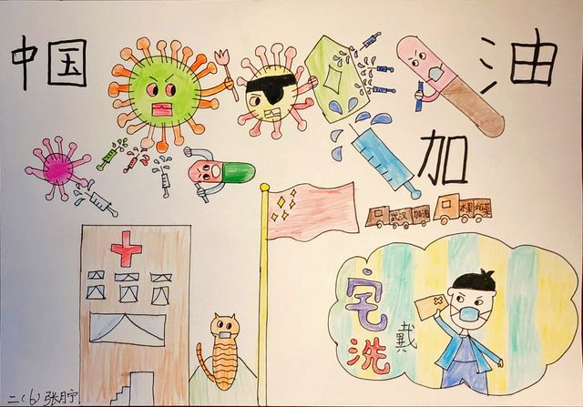

今天上午，8岁的女儿一直在房间里面写写画画，不知道在弄什么。大半天后，神神秘秘的给我展现一张白纸。我正在纳闷，她把纸的另一面翻了过来，一副这样的画映入眼帘。

这个画风我打心底里喜欢！那个独眼龙的病毒，拿着盾牌在顽强地抵抗着药丸的攻击。

另一个大一点的病毒，手里拿着叉子一样的武器，竖着眉毛，二目圆睁，紧紧的咬着牙和针管里射出的药水战斗着。

向医院开去的两辆货车上一辆写着"武汉，加油"，另一辆写着“水果，蔬菜”！

五星红旗把下面的画面一分为二，一边是医院，还有带着口罩的小猫坐在远山上躲避。另一边是电视里每天都在强调的宅，戴，洗和带着口罩的小男孩儿！

我建议女儿把这幅画上色，她说我本就打算上的，于是一副彩色的画作就这样诞生了。

还加上了**“中国，加油”**的字样。振奋人心！

好喜欢！宁宁希望你用画笔表达语言无法描述的，生动的世界。给你带来欢乐，我也能跟着享受这份喜悦！

加油吧，小宁！

