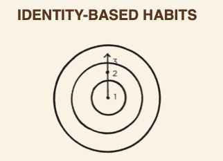

这本书，我不止一次在不同的地方看到。比如中信书店，goodread。打分都很高。但是因为kindle里面要读的书还很多，就一直没有抽出时间来看。最近看到Derek Sivers的关于[这本书的笔记](https://sivers.org/book/AtomicHabits)，以及他对这本书的看法勾起了我的兴趣。所以把这本书排到前面来读。

我喜欢读英文书籍，尤其是文笔流畅，易懂的，逻辑性强的书。如果你也是这样的读者，那么我推荐这本书给你看。

> 合抱之木生於毫末；九層之臺起於累土；千里之行始於足下。-- 《道德经》

首先，我要说作者是个讲故事的好手。不是用干巴巴的理论知识，而是用他自己在高中时的一次严重的受伤，讲述了他的经历和这本书最初最初的源头。日语里叫原点。

市面上讲习惯养成，改变习惯的书籍很多，但是能让人有行动的我看到的不多。这本书我觉得是一本让你能够付诸行动的不多见的一本书。

习惯可大可小，小到个人，大一点的公司，组织，再大一点的国家，再大的可能就是全人类。而要改变习惯，搞清楚**方向**是最重要的开端。如果你连方向都搞错了，那或者事倍功半，或者中途放弃，重新回到老路上。

习惯的三个层次：**Outcome**，**Process**，**Identity**。

- **Identity based**，基于身份的习惯，是从内到外的改变。
  - 从我们希望成为谁开始
  - 在一系列的行动背后都存在着一个信仰的系统

- **outcome based**，基于结果的习惯，是从外到内的改变。（我们一直做的）
  - 从我们想达成什么开始
  - 底层的identity，是关乎我们的信仰，我们的自我形象，这些是行程现有的你，你的习惯的深层因素。
  - 如果identity不发生改变，上层的process，outcome很难持久

> Behavior that is incongruent with the self will not last.
>
> You hae a new goal and a new plan, but you haven't changed who you are.

这本书里面很多有启发性的句子。

比如这句，

> It's one thing to say I'm the type of person who *wants* this. It's something very different to say I'm the type of person who is this.

我想成为什么样的人，我就是什么样的人，把想成为换成了是，这里面的影响是巨大的。wants，也就是你还没有认同你的身份，你依然停留在旧的身份上。而是代表你已经完成了身份转换，是真的站在新的身份的角度在说话。

"You are who you believe"，记得不止一次看到这句话，用在这里我觉得好合适。

最大的障碍来自于身份的冲突。你要打破你多年以来的为自己建立的形象。而维持现状则轻松，舒适。

在拉丁语中的身份，是"essentitas identidem"，意思是being repeatedly。你的身份的字面意思是"重复的存在"。(repeated beingness)

你之所以相信你现在的身份，是因为你可以通过那些多年以来反复做的事情作证明。

身份来自于习惯，他人的看法，社会对你的定位等。但是习惯是最重要的一点。

改变习惯，其实是改变你是谁，是通向新的身份的路径。

每个行动，都会为一个习惯投一票。当票数积累到一定程度，到了阈值的时候，会发生巨变。

改变你是谁的最好的实际行动是改变你做什么。

- 每次你写一篇文章，你就是作家
- 每次你练习打篮球，你就是职业篮球运动员
- 每次你鼓励你的员工，你就是leader
- 。。。

习惯带来的不仅仅是好的结果，更重要的是让你**相信自己**。

改变的两个简单步骤：

1. <u>决定你要成为的类型的人</u>
2. <u>通过小小的胜利不断证明给自己看</u>

