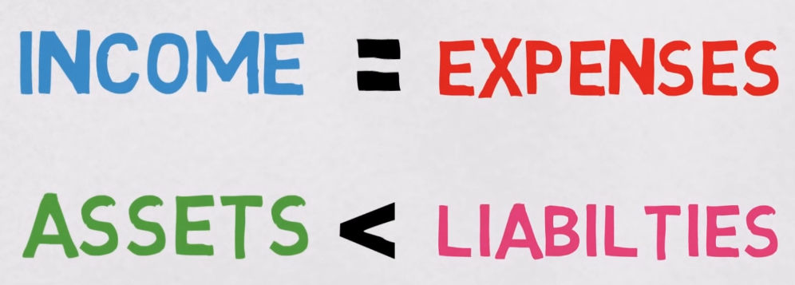
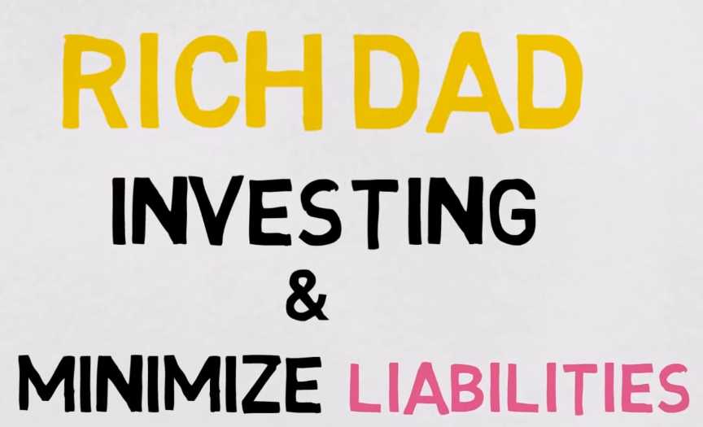
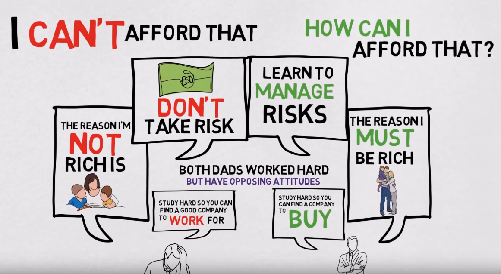
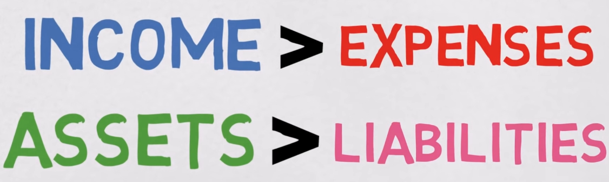

- 要知道资产（Asset）和债务（Liability）的区分。
  - 我理解的资产，是可以保值和升值的，例如房产，投资的股票基金，信托，出租房屋等。自我的培训。- **"SOMETHING THAT PUTS MONEY IN MY POCKET"**
  - 债务，是贬值，不能带来收入的。例如汽车，消费品，奢侈品，贷款等 - **"SOMETHING THAT TAKES MONEY OUT OF MY POCKET"**
- 穷人买债务，富人买资产。
- Cash flow： 现金流的分析看，穷和富之间的最大的差别在于富人在Income之外，还有Passive Income，不需要你花费过多的精力和时间就可以产生收入的资产。比如副业，股票，债券，房产等。

而富人的策略是这样的：不断地投资资产，并且最小化自己的负债。越来越富。

在学习的目的，对事情的看法上有根本的差别。

例如风险，穷人的思维是如何避免，而富人的思维是如何管理风险。

问问自己如果今天没有工作，你的资产能让你活多久？

如果答案是，我已经不为钱工作，而钱为我工作的话，那么就是很好的答案。

[Original Video](https://www.youtube.com/watch?v=TcNpoc-lF0M)

【这些知识对我有什么用？】

- 审视我的资产，负债和开销看是否可以优化，资产的增值是否可以覆盖开销？
- 我的钱有没有为我工作？
- 我对待风险的态度是怎样的，我能否学习如何管理风险？

