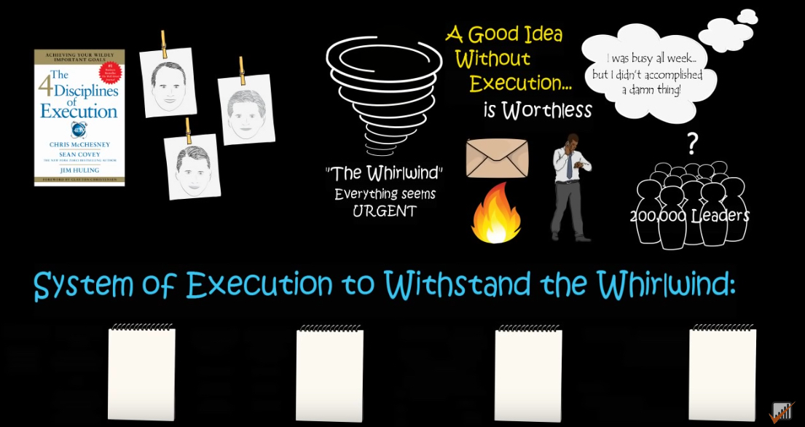
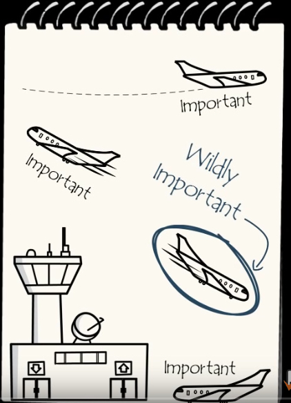
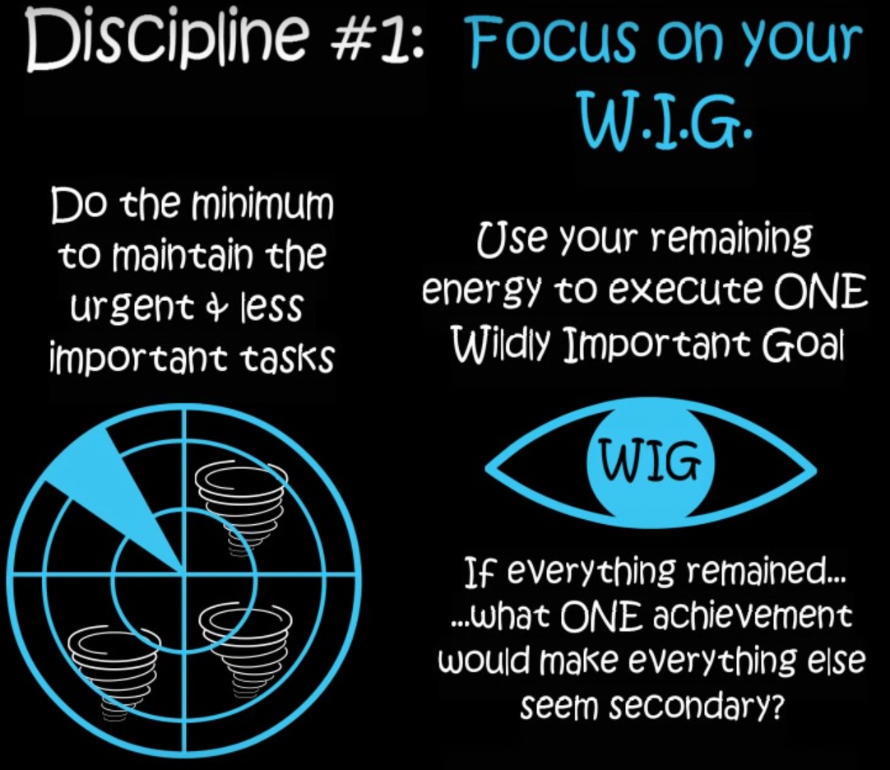
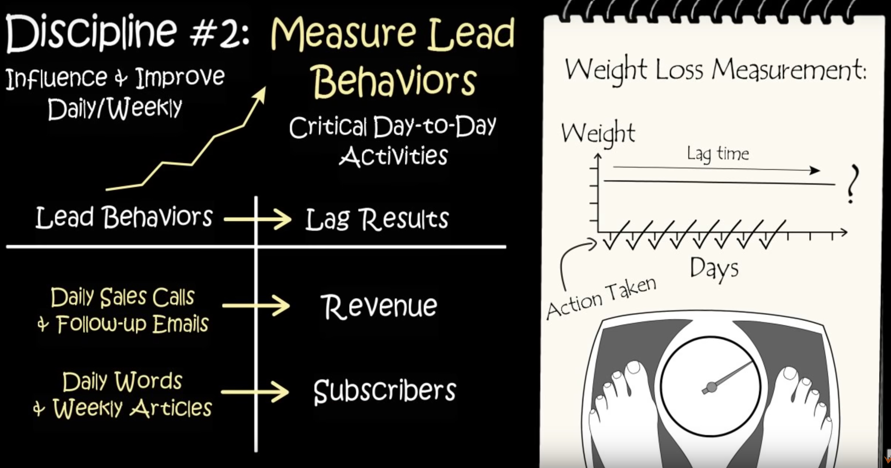
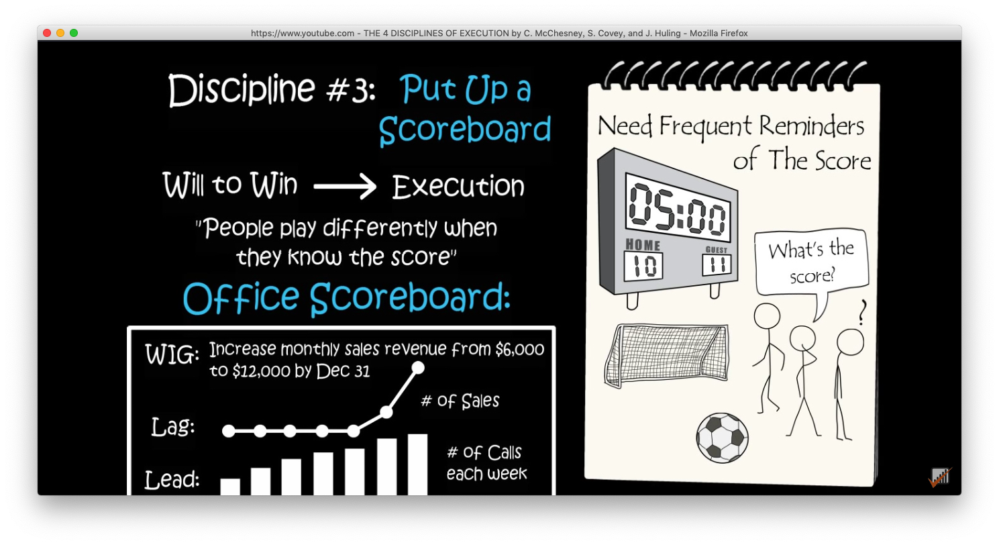
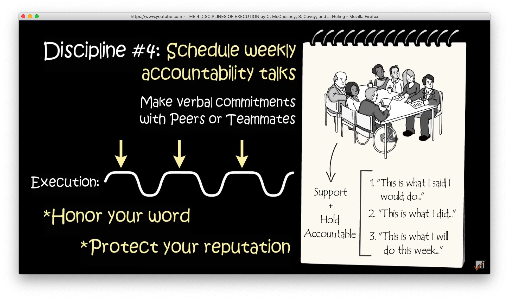
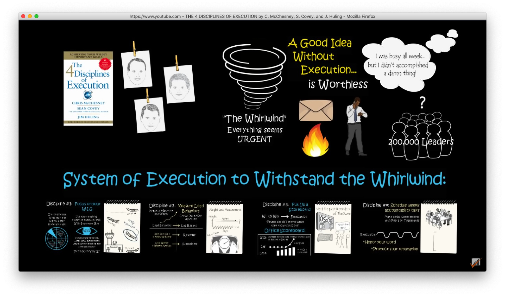

4 个执行原则，关于这本书我想知道如何能够让一件事情，一个需要协作的项目能够不仅仅停留在讨论，计划上面，而是能够通过执行不断地推进，接近目标，达成目标。

这三位作者共同写了这本书。

#### Discipline #1: Focus on your W.I.G

用飞机场的比喻很容易理解。

所有的乘客都会觉得自己的飞机最重要，但是作为塔台工作人员，现在最重要的是正在降落的飞机，如何让这驾飞机安全着陆。而其他的飞机虽然重要，但是重要性就变低了。

从而引申出第一条原则。

- 用你最小的精力去处理紧急但是不重要的事情。

- 而把你所有剩余的精力都用来处理一件最最重要的目标

  如何确定这个W.I.G呢，可以自问一个问题：如果所有的事情都在**，哪一件成就会让所有的其他事都变得不重要？**

#### Discipline #2: Measure Lead Behaviors

为了达成目标，你都会需要时间才能够看到成果。例如减肥，健身，学习一项新的技能。这个被称为"Lag time"。在另外一本书Atomic Habits里面也有涉及，就是在看到实际效果之前有个低谷期。

如果选择的时间长度，测量的目标，方法不恰当，会导致错误的认为没有效果。逐渐失去动力。

比如通过跑步减肥，每天都测量体重，发现体重没有明显下降。但是却没有注意到自己的精力变好，其他方面的指标非肉眼所见的部分也在变好。

所以在这里，作者给出的建议是针对Lead Behaviors，也就是那些促成你达到目标的活动进行统计，测量。比如跑步减肥，你可以测量你的跑步时长，每周的次数，距离等。这样，让你的注意力不是放在那个所谓的目标体重，而是放在你的活动上，你的执行层面上。执行过程做好了，结果自然当然会好。

作者又用了两个例子来解释，一个是提高订阅人数。为了衡量这个目标，我们看具体有哪些动作。你每天写多少字。每周发多少篇文章。另外一个例子是，提高销售额，你每天的销售电话，追踪你的潜在客户的邮件数量等。

这是很好的建议。在实际工作中，个人和团队都可以实践。这不仅仅是一个方法，也是思维方式的转变。

#### Discipline #3: Put Up A Scoreboard

记分牌。这里的例子是，足球比赛中如果没有记分牌，那么比赛双方可能都会慢慢失去兴趣。

作者说，取胜的愿望会让人去执行，而知道比分人们会玩的不同。

这里我觉得有几层意思：

1. 知道比分，也就知道了目标，差距
2. 人们知道比分，才有动力
3. 一个随时可以看到的记分牌，可以实时提醒，激励人

对于记分牌的设计，作者用了将销售额翻倍的一个例子。

记分牌包括：

- W. I.G
- Lag: # of Sales
- Lead: 提高销售额的行动

#### Discipline #4: Schedule Weekly Accountability Talks

定期的会议，最好是面对面的和你的组员分享三件事：

1. 这是我说的我要做的事情
2. 这是我已经做的
3. 这是我将会在这周做的

这样的口头的承诺，如果你可以一直做到，会提高你的信誉，你的组员对你的信任。如果每个人都这样做，效率会提高，不断的达到目标。同时，定期的这样的分享会让大家清楚各自的任务，项目的整体进度。

#### 总结：

#### [Source of the video](https://www.youtube.com/watch?v=2HKn49r3-Ko&list=PL4onSbRkB5zIGhEjVwzwkHuuCtQHss6hN&index=9&t=0s)

