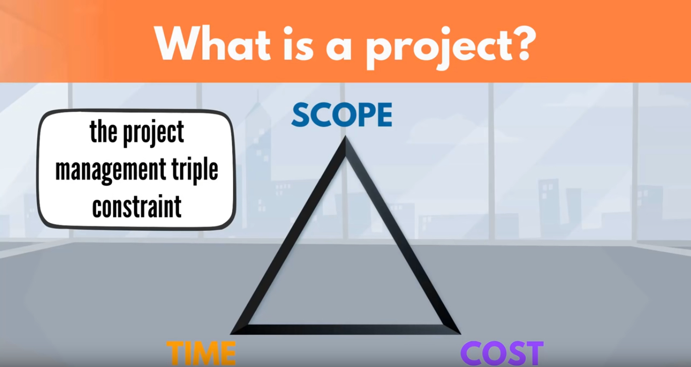
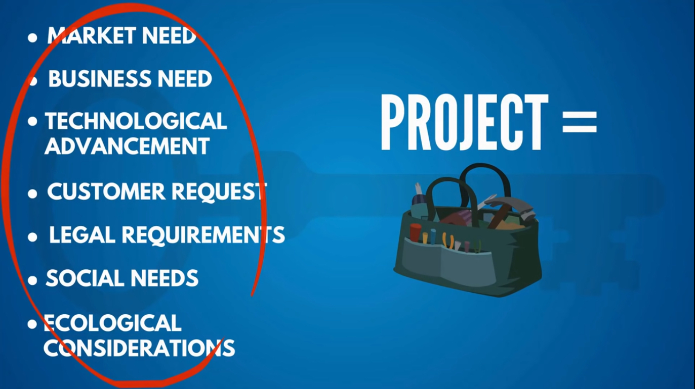
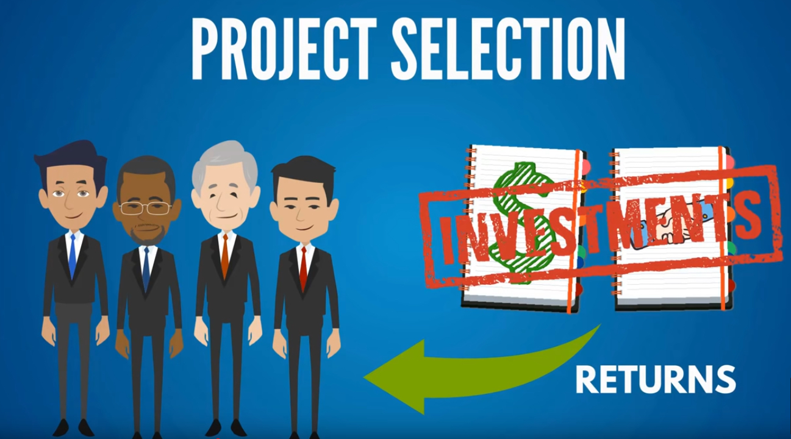
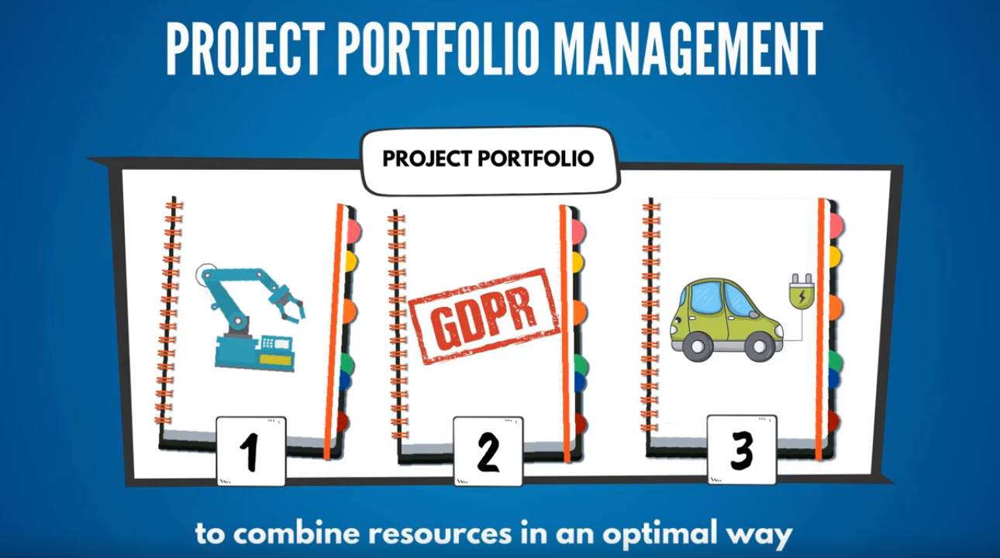
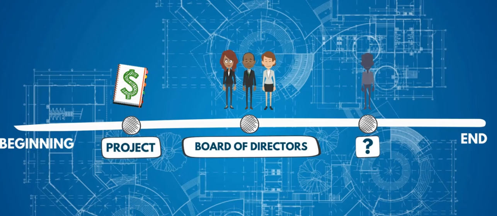
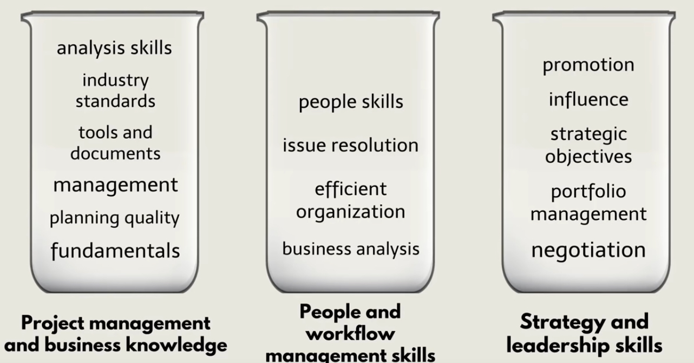
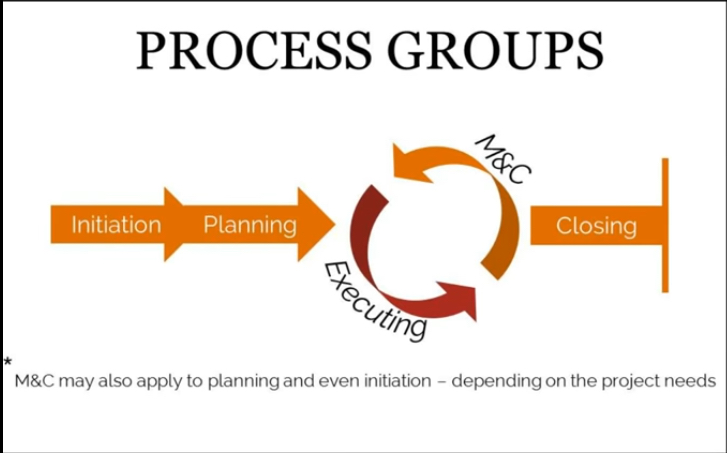

一个项目的三个制约要素：

- Scope
- Time
- Cost

这三个要素相互制约，相互影响。

一个项目是怎么产生的？

项目是和商业策略相关的，可以说商业策略是依据下面这些需求而制定的。而为了满足这些需求，就产生了项目。

而一家公司，可能会面对多个需求，多个项目，那么管理者就要根据紧急程度，重要程度等条件选择去启动哪些项目。这就是“Project Selection”。 这里要注意，项目需要花费大量的人力物力，所以在选择的当初要足够谨慎。**项目就是投资**，所以需要考虑项目的**回报**是什么。

当多个项目被选择执行的时候，就需要按照他们的Portfolio来进行管理。目标就是让资源更有效的利用。

当拥有了一个项目时，一个关键的角色就诞生了。

这个角色需要管理从项目启动到结束，到达成目标的这个过程的工作。

这个角色就是**项目经理**。

“**项目经理就是项目的CEO**”

PM的角色对三个项目的要素要控制，对其负责。

Scope，Time， Cost。

项目经理需要对项目的相关人员协调关系，追踪进度，发现问题并及时解决。

利用自己的技能，知识，专业，经验，态度，让项目能够在正确的方向上推进。

三个核心技能：

- 项目管理和商业知识
- 人员和工作流管理技能
- 策略和领导技能

项目管理，方法的历史回顾。

Project Team Member

Project Stakeholders

Program Management: 同时管理多个项目。

Project Portofolio Management

按照层次划分的话，从下到上是：

- Project
- Program
- Porfolio

项目管理的两项核心的要素：

* **Project lifecycle:** 项目的生命周期。你创建自己的lifecycle。并不是一个周期，因为项目有结束的时间。比如建一栋房子。创建一个网站。

* **Project Management Process**：项目管理流程。有5个组。

  

学习项目管理的目的不是为了证书，找到更好的工作。

而是一个思考问题的方法，对公司的运行有更好地理解。做事情有个一个更清晰的思路。

#### Source Video is [here](https://www.youtube.com/watch?v=rBSCvPYGnTc) 

#### [Another good video](https://www.youtube.com/watch?v=ZKOL-rZ79gs)

