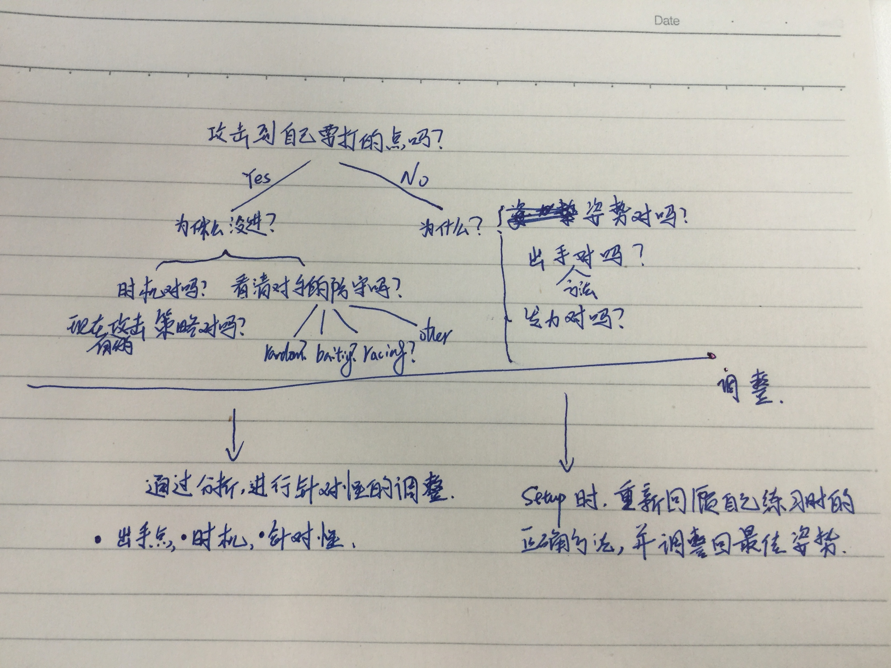

[TOC]

### 总则：外松内紧，下盘稳固，保持平衡，力量下沉，双肩放松，全神贯注，审时度势，及时调整

**放松！放松！再放松！**

让你的身体肌肉无论是传球，射门，还是防守都处于放松的状态。放松不是松懈，是为了让肌肉更加有弹性，动作舒展，到位。僵持的肌肉会让动作变形走样，力量无法发挥。**冷酷的心+火热的手感+正确的策略。**

#### 进攻：（Offense）

【攻击的总则】：找到弱点后，持续攻击对方的弱点，把对方的防守弱点最大化。从而打开其他的攻击点。让对方的防守越收越紧，无论是两侧还是中腹，都是相同的。为了让对手无法猜测你的进攻选择，要点有几个：

1. 无论攻击哪个点，动作都相同，让对手无法从你的身体上发现破绽，预先有准备。

2. 攻击的时间点应该有所变化，不要固定在相同的时间出手。例如每次都是5秒钟左右射门。要变化自己的时间。

3. 攻击的突然性：要让对方无法知道你的出手时机和出手点。时机要变化不固定，出手点一个是要隐蔽自己的动作，另一个是要结合前几次攻击的情况来看。例如，如果前几次虽然看到了漏洞，但是都被对手防守下来了，那么此时要冷静下来，分析问题出在哪里。是出球的点没打到，还是打到被防守到了。如果是后者，那么很可能对方是在用baiting，也就是说你出手的点被对手设置好，并且被对手抓到了出手的时机。此时，你要重新考虑自己的进攻。在前两点上找到自己的问题，如果有问题，尽快调整，如果没有问题，有可能对方是在用模式防守，在固定的时间关闭固定的洞，那么这时候你要开始调整攻击策略，例如在相同的时机去攻击对方的人，而不是球洞。或者攻击看似比较难的洞。或者变换时机，攻击相同的洞，逼迫对方做出调整。

4. 专注：射门过程中要集中所有的注意力，观察对手，执行射门，头脑保持冷静，清楚的分析。

5. 无论哪一种进攻，如果经常被对手防守住，那么就要冷静的分析问题所在，不要焦躁，盲目的进攻。这样会更加降低自己的成功率。可以尝试从几个方面进行分析：

   {0}. 有没有攻击到自己想要的点？

   {0}. 进攻的点是对手偶然防守住的，还是被对手主动防守到的。问题出在哪里？是不是自己每次进攻的时间大体相同？还是自己的攻击点没

   {0}. 分析后，要开始做出针对性的调整，例如攻击点不变，但改变自己的攻击时机。或者改变攻击点，不改变攻击时机。或者同时改变时机和攻击点。调整后要根据效果再次进行分析和调整。例如，通过调整后发现成功率提高，此时对手是否做了调整，如果没有，继续使用刚才的策略，如果改变了，自己是否需要调整。

   

##### 3-Bar：

1. 蛇形射门（Snake/Rollover Shot）

   握法手型因人而异，结合自己的身体条件来选择最适合自己的。前提是掌握snake shot的几大要点：

   - 三人杆停好球以后，将手臂放松，慢慢的将球pin好，这里一定一定不要失误！！切记！
   - 踩好球以后，双脚和身体位置调整到平时练习的姿势，将重心下沉到双脚！让双臂肌肉完全放松，完全不吃力。只有将所有力量下沉到双脚上，才能做到。
   - 站位方面，应该靠左侧一些，用对方的5人杆对准自己的身体的中心线。
   - 手腕和握把的接触应该有个最佳结合点：这个点可以让球杆的控制达到最佳状态，不是非常紧，也不是非常松，应该松紧适中。过紧失去灵活性，过松失去控制性。不松不紧即可以保持控制性也可以保持灵活性。
   - 手腕的位置，不要太靠近手掌。太低在击球后没有足够的延展，速度和力量不够。太高也不好，过高虽然可以有很好的击球力量和速度，但是对球杆的控制性会下降。球的横向移动会减速，甚至丢球。**诀窍在于可以用左臂做一定的支撑**，不让身体下沉过多。
   - 双肩，手臂，手指应该放松，可以让肌肉保持弹性，才能发力充分。
   - 身体不要过分下压，保持一定的高度，出球时可以更加自如。因为出球时，旋转杆子是向上带动手腕和小臂，如果身体下压过低，上提的动作会比较难做，难以发挥力量。
   - 在rock 球的时候，首先要找到pin球的最佳位置，让球和小人具有足够的摩擦力和借出。例如小球的中心线位置。rock的时候力量保持中等，不要过于下压或者过轻。下压力量太大的话，球的横向移动距离变短。原因在于下压的动作过大，在让球横向移动后，依然保持下压的动作的话，无法让小人到达足够远的地方就要出球，导致距离变短。下压力量太轻的话，会让球的横向移动变慢，甚至无法移动球，漏击等情形。所以中等力量可以让球有足够的横向移动速度和距离。扩大射门范围。
   - 击球的时候，原理是人快过球，球到达自己想要的点以后迅速转杆，最后用手指停住。如果需要打出直角射门，push side需要回拉，pull side需要回推。回拉和回推的幅度不用太大，中等即可。过分的recoil虽然振奋士气，但是消耗额外的体力。
   - 击球点的选择除了两侧的1号和5号洞，2，3，4同样重要。不要忘记中间的洞。
   - 不要暴露自己的射门时机：如果你观察大师级别的选手的snake射门，他们在启动的一瞬间都是几乎没有暴露自己要开始射门的意图的。这一点容易忽视，但是非常重要。一般的snake射门为了隐藏出手时机，会在中心位置不停的rock球，再启动的时候可以在rock的过程中打任意一边，而不会在此时有例如突然停顿rocking，或者突然加快rocking速度等动作。因为这类动作很容易被聪明的防守者抓到并加以利用。所以为了隐蔽这一点有两种方法：
     - **方法一：**练习过程中，要刻意练习rocking的时候，随时可以攻击任何一点。例如，先练习中间3号洞，心里默数随机的秒数，然后到达随机秒数出球。当然可以录音一段，随机的秒数，随着录音叫出的攻击点马上出球。这样可以大大增加snake的成功率，因为对手完全不知道你什么时候出手。
     - **方法二：** 静止的情况下出球，不rocking。这个很好的方法之一，因为并没有人规定snake 一定要rock，rocking原本的目的就是隐藏意图。不过如果你做不到方法一，或者想增加选择，就可以练练静止pin的情况下出球。如果结合类似tony的pin球方法，威力会更大。
   - 射门的方法：
     - 观察防守，理解防守人的意图，选择时机，不要失误，保证每次出球都是你想要的点。
     - 如果无法破解防守人的意图，例如对方抓到了你的射门的特点和出手的时机，试图用防守迷惑你，有几种方法可以尝试。
       - 读秒，看是否对方的防守在固定的时间会露出固定的点，然后在下一次出现漏洞的同时出手
       - 预先设定攻击点，自己读秒，在一个自己选择的时间点上，出手。针对随机性防守比较有用
       - 如果防守没有一定的模式，可以通过walking ball来试探对方，看他是否在看你的球，并作出何种反应。例如，在3号点原地，或者移动到2，4，甚至1，5，来看对方的防守有何变化。根据变化来确定自己的选点。例如，每次在移动到4号的时候，对方会迅速防守3，4，5，那么此时可以选择1，2洞作为攻击点。或者对方不为所动，依然防守4，3，2，那么此时最容易攻击的点就是5号。如果对方防守5，4，1，那么可以选择3，2来打。
       - 进阶技能：创造机会，撕裂防守。

2. 拉射 （Pull Shot）

3. Euro/Front Pin

4. Pull Kick

5. Push shot

6. Push Kick

7. Sling Shot

8. Trick Shot

##### 2-Bar：

##### 5-Bar

#### 防守：（Defense）

【防守的总则】：用防守带动进攻，让对手在你预设的时间点和位置出球，并实施拦截。而不是被动的跟着对手的节奏走。攻击要隐蔽where和when，所以防守要从这两方面入手。要做到这一点，有几个要点要掌握：

1. 时刻把大部分注意力放到自己的防守位置上，要了解自己的防守在什么位置，也就是了解了目前你暴露了哪些点给对手。这是Where也就是攻击点的引领方法。
2. 至于when，也就是对方的出球时机，需要从攻击上反其道而行之。当然最根本的一点是你要了解你的对手：
   - 攻击的强侧和弱侧：封强补弱，诱使或者逼迫对方攻击自己不适应的点，可以让他暴露自己的攻击时机。例如，有的选手在攻击弱侧和强侧的时候身体动作，握杆方法不同，可以利用这些信息预判对手的攻击点。或者有的选手出球的时候，喜欢突然停顿或者突然加速，这也是一个很有用的加以利用的信息。
   - 还有的选手攻击前喜欢敲击一下球，或者移动一下球，比如先移动到4号洞，马上攻击一号洞。可以针对这样的进攻习惯，在4号洞移动时封堵1号洞和四号洞。或者封堵3，4，5，然后马上回防1号。
   - 有些选手喜欢1，3，5，但是2，4不打，所以可以在攻击时机前封堵1，3，5，例如先关闭3，5，暴露一号洞，然后预先封堵。
   - 有的选手如果pull side打不进，下次就打push side，如果再不行就再来pull side或者middle。这类的话，需要记住上一次对手的攻击是否成功，如果成功，可能他下次还是打这里，如果失败，就要多注意他打另一侧。当然也可能对手会攻击相同的点。这时你就要参与到对方的进攻里面。
3. 如果对手无论是攻击点还是攻击时机都隐藏的很好，怎么办？
   - 参与对手的进攻，也就是要记住对手每次进攻是成功了还是失败了，成功的是什么时候攻击的哪里。失败的时候同样也要记住这两点。
   - 对方成功后，下次进攻大部分的选择是什么。是攻击相同的点，还是会根据防守再调整。如果前者，可以提前预判。如果后者，那么需要到下一步。针对对手进攻失败的情形，用相同方法分析。
   - 一种策略是，在对手没有证明防守无效时，保持防守策略，逼迫对手改变。
   - 针对一个很好的前锋，特别是他能读懂你的防守策略后，进攻的效率会很高。这时候，你要调整，不要一成不变，那么等待你的就是失败。准备几套防守策略，并都练习到非常熟练，随时可以切换。
   - 如果你无法防守住对方的大部分进球，请自问这几个问题：在5人杆的防守能否防住呢？你自己的进攻的成功率呢？对方后卫出球后，你防守的成功率呢？
   - 如果你上面的都做到了，但是依然无法赢球，那么说明对方是比你更加厉害的选手，你可以赛后和他交流一下，争取获得一定的经验值。为下次比赛增加筹码。相比赛后自己琢磨，这是比较容易获得经验的方法。推荐！

##### 2-Bar：

防守基本方法：

1. 静止，racing
2. shuffle，也就是在1号洞到5号洞之间无规律摆动
3. 补漏洞方法，在固定或者随机的时间上，打开和关闭不同的洞，让对手无法阅读防守
4. Baiting
5. ​

##### 5-Bar：

防守如何才能让球防守下来以后不再回到对方脚下呢？答案就是，如果你可以预测到对手的传球线路，预先堵截，并把小人略微向后，将对方的传球力量卸掉，然后拿下球。回击球，或者力量过大，都有可能再次回到对方脚下。

##### 3-Bar：

3人杆面临的主要是对方的后卫射门和传球。

- 针对射门，主要的技巧是和自己的其他的防守杆组成防守阵型，能够通过阵型来破坏对方的进攻。英文称为zone defense。而且要记住，无论怎样的阵型，总会有漏洞存在。这一点在自己练习2人杆射门的时候会有更好地体会，同时也可以通过后卫的进攻练习，帮助自己的防守提高。
- 区域防守，和后卫防守在概念上类似，就是要知道不同的防守阵型中打开的和关闭的洞在哪里，根据对手的进攻特点和能力，布置相应的防守，在对方攻击的时候封住对手的进攻路线。当然也可以通过阵型逼迫对手去打他不习惯的洞，或者逼迫对手只能clear ball，而不是对球门发起进攻。

#### 传球：（Passing）

【传球的总则】：让对手相信你的出球点和出球时机，然后选择其他的时机和出球点。这一点和篮球的进攻技巧相类似。篮球中的突破的技巧就是让对手以为你要从一个方向走，结果却从另外一个方向突破。例如cross over，背后运球变向等等。可以利用这个概念，来训练和提高你的传球成功率。例如，通过假动作让对手以为要上刷球，结果确是下刷球，或者反之。可以充分利用球的移动方向和一般人会选择跟随球来移动防守的特点来布局。例如：

- 球向下移动的时候，一般人会跟随球移动或者在墙一侧防守，此种防守可以通过上刷以及出球时机的变化来破解。
- 有些防守人假装守在墙，但是会观察传球者的传球时机，在传球时机到来前先行站到防守漏洞上（此时是lane），试图组织防守。针对此类防守，有几种方法可以破解：
  - 一种方法是，继续坚持上刷，但是改变出球的时机，让对手来不及防守，例如runner pass
  - 还可以在1点直传或者下刷，让对手同样无法防守
  - 还可以在出球前通过小人的假动作，让对手以为要出手的时候离开墙的位置，此时下刷或者直传，这要根据对手离开墙的距离来决定

站姿： 双脚开立与肩同宽或者略宽，也有选手喜欢双脚并拢，重心放在双脚上，让双臂放松。

站立的位置：五人杆应该和自己的身体中心对齐，5人杆和自己的肚脐的纵向的中心线对齐。好处是：可以让球在5人杆的小人之间沿直线运动，更加轻松的传球。另一个好处是，右脚不会过于靠近3人杆。如果身体过于靠近3人杆，问题在于右手手腕再接球的时候所能旋转的范围将随着右脚距离3人杆的接近而变得越来越小。导致接球的成功率下降。身体距离桌子应该有一定的距离，标准是能够让5人杆轻松的在最远和最近的距离移动。

传球前的准备：

1. 深呼吸，放松身体，意识集中到传球上。进入到zone的状态。
2. 按照上面的站里位置调整好位置和站姿。
3. 右手在三人杆上确认摆动的幅度和平时训练相同。能够很舒服的摆动，接球。
4. 左手挥杆，保证自己的动作的舒适性，能够让杆子自由的前后，上下移动。

##### 5-Bar：

- 刷球（Brush Pass）
  - 要点之一：在刷球的时候，保持小人在球的后方偏下一点，这样可以保证brush up的力量。原因是，小人和球虽然很近但是还是有一定的距离，在耍球的瞬间，小人下压过程中球依然还在行进过程中，如果在正下方出球，球会偏离中心点，导致力量和角度不够。如果小人稍稍领先于小球，在刷球瞬间正好是球到达小人正下方的时候，力量和角度最好。偏离的角度要和球的移动速度匹配。如果球速非常快，那么偏离的距离就要加大，如果球速很慢很慢，这是偏离非常小，几乎看不出来。所以要根据自己的球速设定小人和小球的相对位置，达到最好的出球效果。
  - 刷球过程中，因为是小人下压，并且靠手腕的角度决定出球的方向，所以不宜太快。慢好过快。最理想的情况之一就是，在球快停的时候，让对方不得不做出判断的后，向相反方向出球。所以除了要观察自己的人球位置之外，还要注意对方的防守站位。
  - 刷球不要有后摆的动作。后摆会造成几个问题，一个是，暴露自己的出球时机，让对手更容易防守。第二点是，后摆加大了人球的距离，很难保证球是在小人正下方出球的。从而影响了球速和角度。第三，后摆很容易造成击球，而不是刷球。
  - 刷球的前摆也不要太大。刷球瞬间是一个剧烈的人球摩擦的过程，力量聚集于此，球被挤出去。过大的前摆会抵消这部分的挤压力量。
  - 刷球的点要变化，否则很容易被对手摸到规律后加以针对性的防守。例如，从启动开始，可以直线，下刷，第二点开始就可以上刷，下刷，直线，到最后的墙还可以上刷和直线。所以每次移动都可以有很多的出手机会和选择。要根据对手防守选择最佳路线和时机。可以把从启动开始到墙划分成几个点，分别针对这几个点练习上刷，下刷，直线。这样对手要时刻提防你出球，传球成功率会提高。
  - 除了基本的从上到下和从下到上的移动球，还可以通过球和人的撞击改变球的移动方向，从而为传球增加更多的变化。例如，球从1到4或者5后，反弹球，然后跟上球后再次可以up，down，straight。
  - 从球移动开始就要观察对手的防守，思考传球的路线。前几次移动可以是试探性质的，比如第一次球向下移动，然后球借助51的小人或者墙反弹回后，对方的防守是怎样的。看清楚之后，可以在传球时做到心里有数。因为大部分的选手的防守模式相对固定。当然如果碰到更狡猾的对手，可以多试探几次。

- 静止传球 （Stick Pass）
- tic-tac
- 中间人传球
- Wall pass
- Bouncing Wall pass

##### 2-Bar：

#### FAQ

- 如果状态不好怎么办？

  暂停，先让自己放松下来，重新回到桌子前，把传球，进攻，防守等要点重新调整到训练时的最佳状态。胜利是一件件的小事的汇总。例如，回到桌子前，深呼吸，把重心调整好，站姿按照传球部分的描述调整好，传球的时机，方向做出调整。射门也是一样，调整好重心，姿势，握杆，然后针对对方的防守利用前面谈到的技巧进行调整。

- 如果防守不住怎么办？

  首先保持冷静，不要气馁。分析自己的防守和对方的进攻特点。根据对手的特点改变自己的防守策略。另外，如果依然防守不住，你自己的进攻应该要做到更好。如果观察很多大师级别的比赛，双方的比分基本是交互上升，所以最好的防守之一就是进攻。如果自己的进攻成功率增加，会带来很多好处：例如，给对方的防守施加压力；对方如果有很好的后卫射门，因为你的三人杆的成功率很高，对方没有机会从后卫射门；好的进攻会带动你的防守信心。

  另外，保持攻击性，侵略性的防守。并且抛开比分，从手头上目前可以做的事情上入手，把它做到最好。比如说，被对方领先，此时你发球，这时应该抛开比分和刚才的防守的问题，头脑中应该只想如何把球成功的传给自己的前锋。**专注在你控制范围中的事情。而不是已经发生的事情。** 同样，当三人杆拿球后，应该全神贯注在进攻上，打破对方的防守，执行好（Execution）自己的射门。如何做到呢？每次轮到你发球，深呼吸，把身体和中心调整好，试着清空头脑，注意力集中在当下的传球上。

- ​

- ​